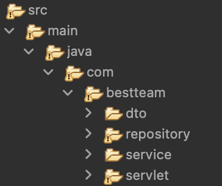
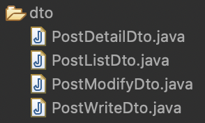
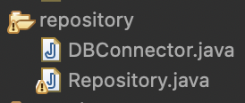
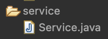
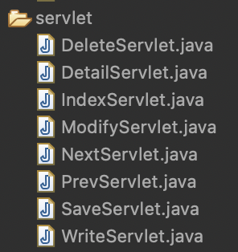
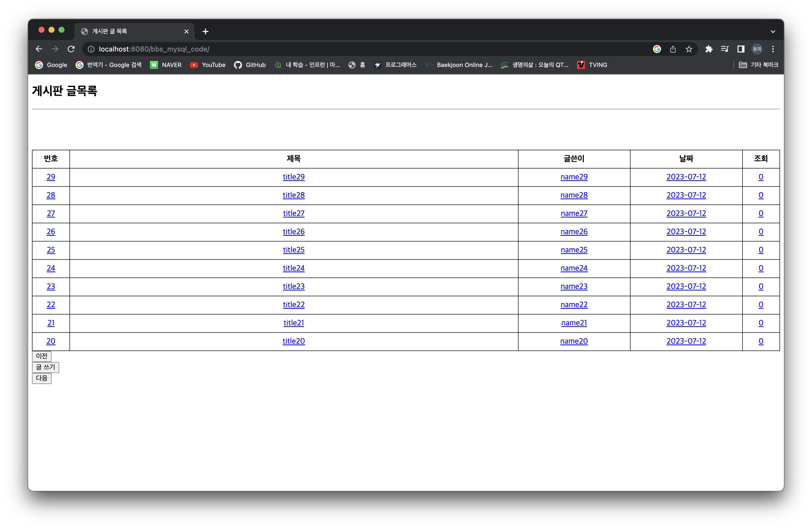
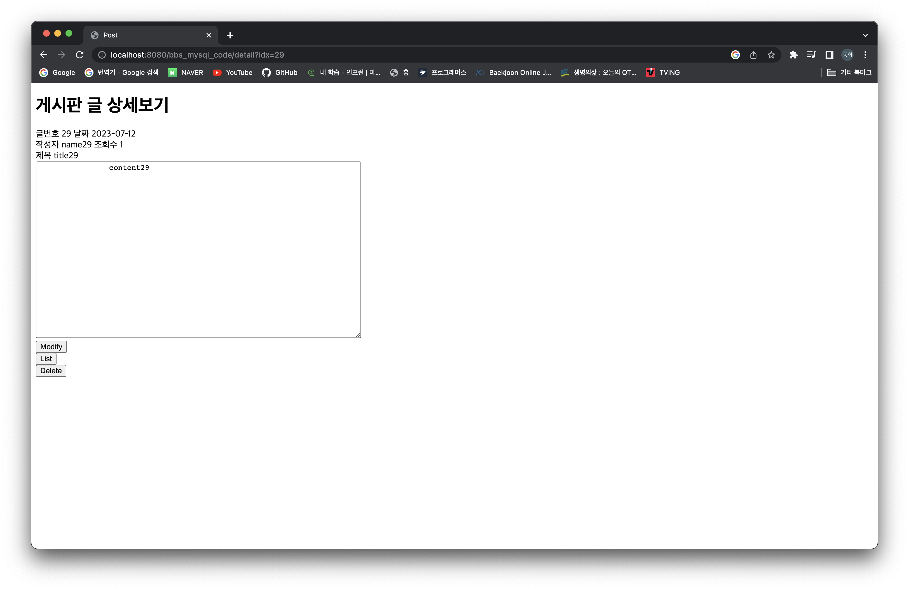
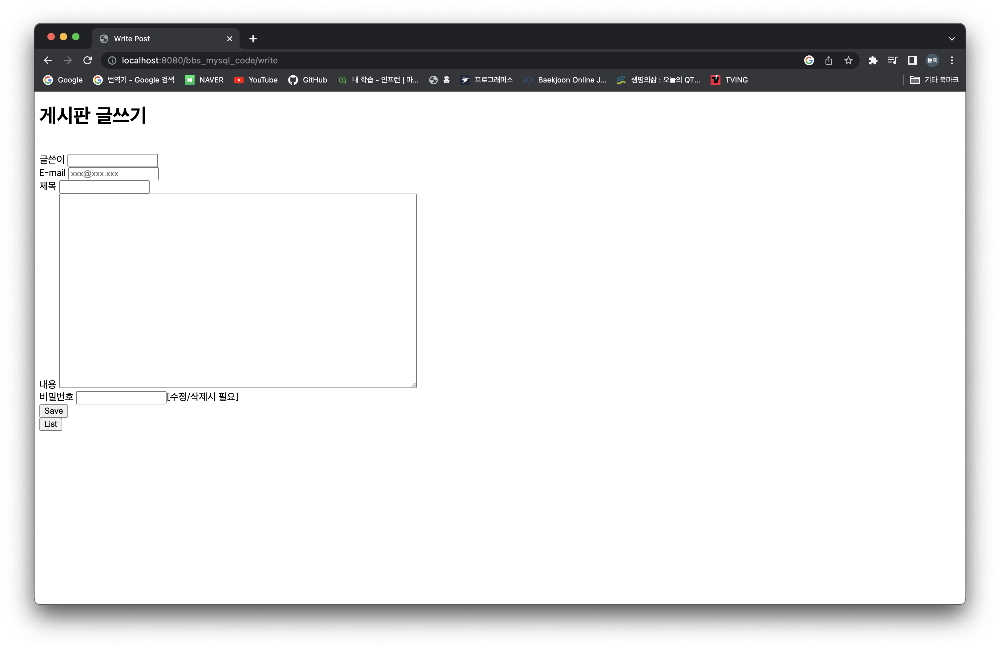
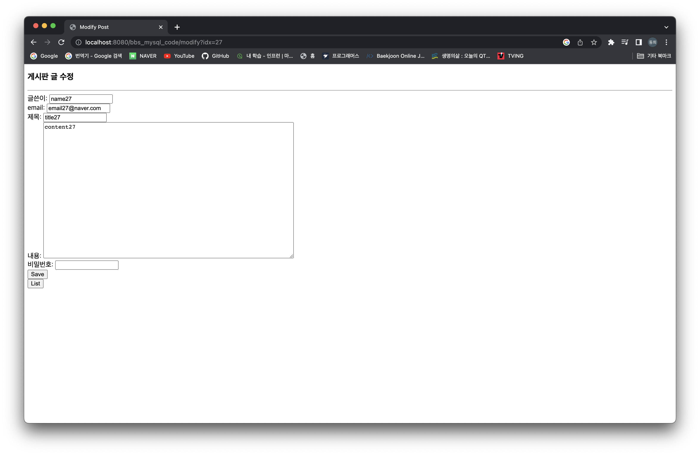
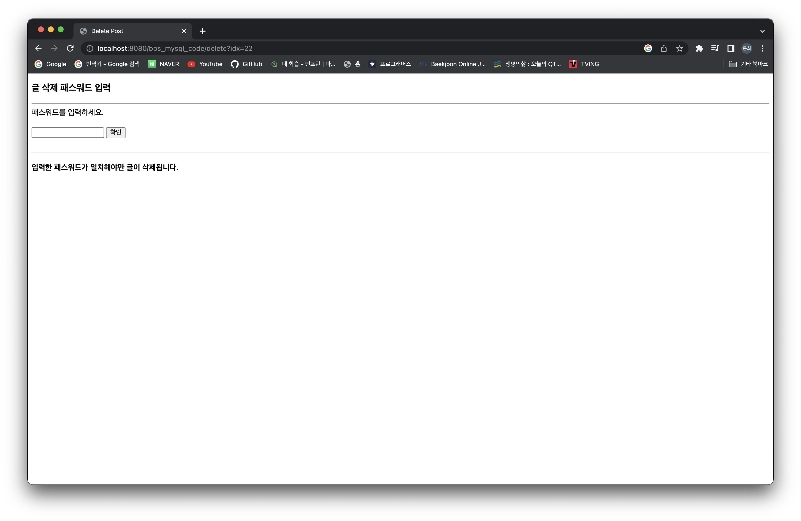

# 팀 실습

&nbsp;&nbsp; 어제 배웠던 내용을 토대로 팀끼리 프로젝트를 하나 만들어보는 실습을 진행하였다.
요구 사항은 일반적인 게시판을 만드는 것! 디테일한 사항은 부트캠프 카페에 나와있었다.

&nbsp;&nbsp; 우리 팀은 4명이서 한 조가 되어 실습을 진행하였고, 역할은 다음과 같다.

- 강동희(나) : 프로젝트 전반적인 구조 형성 및 servlet, service 패키지 구현
- 이*희 : DB와 통신할 repository 패키지 구현
- 김*호 : jsp 파일 작성
- 명*식 : jsp 파일 작성

 

## 프로젝트 진행

### 진행 전 토의

&nbsp;&nbsp; 프로젝트를 진행하기 전 업무 분담을 하면서 각 기능 별로 데이터가 어떻게 흐르는지,
또 데이터 및 메서드, 파라미터 등의 이름은 어떻게 할지 토의를 진행하였다. 토의한 내용을 토대로 각자 맡은 부분에만 전념하여 구현을 진행하였다.

### 프로젝트 구조

1. **자바 코드**
   1. 패키지  

      1. dto : JSP - Servlet - DB 사이에 주고 받는 데이터 클래스의 집합  

         - PostDetailDto : 게시글의 상세 내용에 필요한 데이터들의 집합
         - PostListDto : 게시판 데이터들의 집합
         - PostModifyDto : 게시글 수정에 필요한 데이터들의 집합
         - PostWriteDto : 게시글 생성에 필요한 데이터들의 집합
      2. repository : DB와 직접 통신하는 패키지  

         - DBConnector : DB와의 연결에 필요한 클래스
         - Repository : DB에 직접 데이터를 조회, 삽입, 삭제, 수정하는 클래스
      3. service : Servlet과 DB 사이를 연결하는 로직이 들어있는 패키지  

         - Service : Servlet이 의존하는 클래스. Servlet과 Repository를 연결시키는 매개체
      4. servlet : Servlet 클래스의 집합  

         - DeleteServlet : 삭제 요청을 처리하는 서블릿
         - DetailServlet : 상세 조회 요청을 처리하는 서블릿
         - IndexServlet : 초기 화면을 처리하는 서블릿
         - ModifyServlet : 수정 요청을 처리하는 서블릿
         - NextServlet : 다음 페이지 요청을 처리하는 서블릿
         - PrevServlet : 이전 페이지 요청을 처리하는 서블릿
         - SaveServlet : 게시글 저장 요청을 처리하는 서블릿
         - WriteServlet : 게시글 쓰기 요청을 처리하는 서블릿
   2. webapp  

      - DeletePost.jsp : 게시글 삭제 화면
      - ModifyPost.jsp : 게시글 수정 화면
      - PostDetail.jsp : 게시글 상세 조회 화면
      - PostList.jsp : 초기 화면
      - WritePost.jsp : 게시글 쓰기 화면
      - data : 테스트용 초기 데이터 파일

### 구현 결과

1. **초기 화면**  

   1. 게시글 클릭 시 조회수 증가 및 상세 조회 화면으로 이동
   2. 이전, 다음 버튼으로 페이지 구현
   3. 글 쓰기 버튼 클릭 시 글 쓰기 화면으로 이동
2. **상세 조회**  

   1. Modify 버튼 클릭 시 글 수정 화면으로 이동
   2. List 버튼 클릭 시 초기 화면으로 이동
   3. Delete 버튼 클릭 시 글 삭제 화면으로 이동
3. **글 쓰기**  

   1. 모든 입력란 필수 입력, email은 이메일 형식 요함
   2. Save 버튼 클릭 시 해당 게시글 저장 및 상세 조회 화면으로 이동
4. **글 수정**  

   1. 패스워드 불일치 시 패스워드 불일치 알림 이벤트 발생
   2. 패스워드 일치 시 해당 게시글 수정 및 초기 화면으로 이동
   3. List 버튼 클릭 시 초기 화면으로 이동
5. **글 삭제**  

   1. 패스워드 불일치 시 패스워드 불일치 알림 이벤트 발생
   2. 패스워드 일치 시 해당 게시글 삭제 및 초기 화면으로 이동

 

## 느낀 점

&nbsp;&nbsp; 팀 프로젝트 진행 전 충분한 토의 및 구조 생각을 통해 보다 발전된 분업과 구현을 이루어 낼 수 있었다!
코딩을 하기 전 얼마나 많은 것들을 정해야 하는지, 그런 것들을 미리 정해놓아야 모두가 편해지는지 깨닫는 귀한 경험이었다.
이런 구조를 짜고 각 클래스 별로 역할을 주어서 해당 역할에만 집중해서 구현하는 것이 재미있었다.

### 어려웠던 점

&nbsp;&nbsp; JSP 파일이나 자바 스크립트 쪽 문법을 잘 몰라서 많이 애를 먹었다. 그래도 이번 시간을 통해 꽤 다양한 것들을 알게 되어서 좋다고 생각한다.

---
[<== 부트캠프 14일차](/bootcamp-day14) &nbsp;&nbsp;&nbsp;&nbsp;&nbsp;&nbsp;&nbsp;&nbsp; [부트캠프 16일차 ==>](/bootcamp-day16)