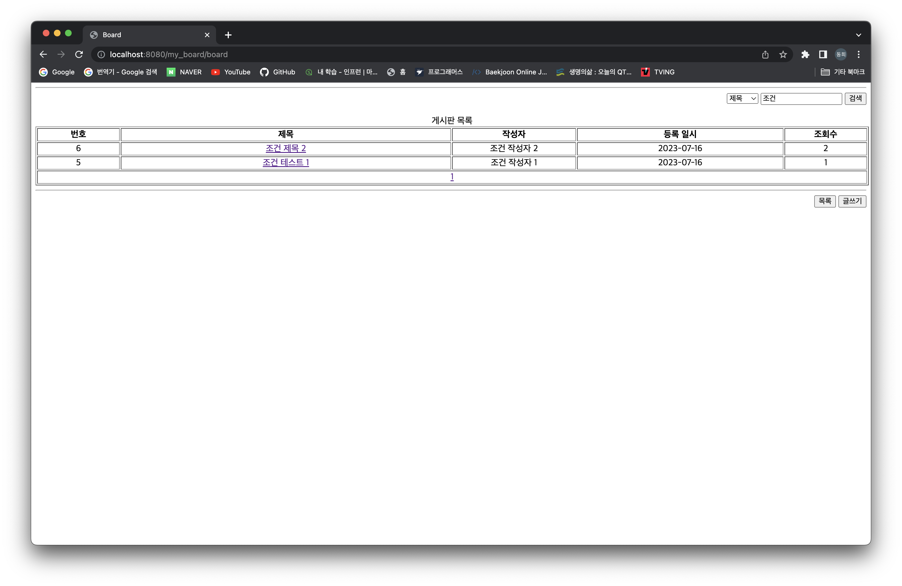

# 팀 프로젝트 실습

## 요구사항

&nbsp;&nbsp; **기본적인 게시판 기능**

1. 게시글 조회 기능
2. 게시글 등록 기능
3. 게시글 수정 기능
4. 게시글 삭제 기능
5. 게시글 검색 기능
6. 게시글 페이징 기능[**추가**]

 

## 개발 전 토의

&nbsp;&nbsp; 개발하기에 앞서 데이터 호환을 위해 변수명, 메서드명 등을 사전에 정했다.
또한, 각 패키지 및 파일들이 어떻게 동작하는지, 어떤 데이터들을 어떻게 주고 받아야 하는지 미리 합의함으로써 개발 분업이 수월하도록 하였다.

 

## 토의 내용

&nbsp;&nbsp; 하기 내용은 사전에 토의한 내용이며 개발을 하면서 미처 생각하지 못한 부분들을 그때그때 수정해나갔다. 후에 변경된 내용은 대괄호 []로 표기하였다.

### 화면(src/main/webapp/)

#### 초기 화면

- ~~IndexServlet 호출 -> index.html~~
- 게시판 만들기 버튼 클릭 -> BoardServlet 호출[**uri에 파라미터 pageNum=1 추가**] -> BoardList.jsp

#### 게시판 조회(BoardList.jsp)

- 받을 데이터
  - postList
    - 타입 : List<PostListDto>
    - 내용 : 게시판에 보여줄 게시글의 목록. 최대 10개이다.

  - pageTotal[**추가**] // todo 번호 버그 수정
    - 타입 : int
    - 내용 : 전체 페이지의 수.

  - ~~pageNum~~

- 검색 버튼 : 누르면 해당 내용이 포함된 게시글을 검색함, BoardServlet 호출(action="board" method="get")
  - 보낼 데이터
    1. 검색 조건(name="searchCondition")
    2. 검색 내용(name="searchContent")
    3. 페이지 번호(type="hidden" name="pageNum", value="1")[**추가**]

- 목록 버튼 : 누르면 BoardServlet 호출(href="board?pageNum=1")

- 글쓰기 버튼 : 누르면 PostWriteServlet 호출(href="write")

- 제목 클릭 : 누르면 PostDetailServlet 호출(href="detail/num={num}")
  - 보낼 데이터
    1. 글 번호(name="num")

- 페이지 숫자 : 클릭하면 BoardServlet 호출(href="board/pageNum={pageNum}")
  - 보낼 데이터
    1. 페이지 번호(name="pageNum")

- 등록된 게시글이 없을 경우[**추가**] : "등록된 게시물이 없습니다." 출력

#### 게시글 등록(PostWrite.jsp)

- 받을 데이터 : 없음

- 입력 폼
  1. 글 제목(type="text" name="subject" required)
  2. 글 작성(type="text" name="writer" required)
  3. 글 내용(name="contents" required)

- 글쓰기 버튼 : 누르면 PostSaveServlet 호출(action="save" method="post")

- 목록 버튼 : 누르면 BoardServlet 호출(href="board?pageNum=1")

#### 게시글 상세 조회(PostDetail.jsp)

- 받는 데이터
  - num
    - 타입 : int
    - 내용 : 게시글의 글 번호

  - subject
    - 타입 : String
    - 내용 : 게시글의 제목

  - writer
    - 타입 : String
    - 내용 : 게시글의 제목

  - contents
    - 타입 : String
    - 내용 : 게시글의 내용

  - hit
    - 타입 : int
    - 내용 : 게시글의 조회수

  - reg_date
    - 타입 : String
    - 내용 : 게시글 등록 일시

- 목록 버튼 : 누르면 BoardServlet 호출(href="board?pageNum=1")

- 수정 버튼 : 누르면 PostModifyServlet 호출(href="modify?num={num}")
  - 보낼 데이터
    1. 글 번호(name="num")

- 삭제 버튼 : 누르면 PostDeleteServlet 호출("delete?num={num}")
  - 보낼 데이터
    1. 글 번호(name="num")

#### 게시글 수정(PostModify.jsp)

- 받는 데이터
  - num
    - 타입 : int
    - 내용 : 게시글의 글 번호

  - subject
    - 타입 : String
    - 내용 : 게시글의 제목

  - writer
    - 타입 : String
    - 내용 : 게시글의 제목

  - contents
    - 타입 : String
    - 내용 : 게시글의 내용

- 수정 버튼 : 누르면 PostModifyServlet 호출(method="post")
  - 보낼 데이터
    1. 글번호(type="hidden" name="num" value=num)
    2. 제목(type="text" name="subject" value=subject required)
    3. 작성자(type="text" name="writer" value=writer readOnly)
    4. 내용(name="contents" required) - contents

- 목록 버튼 : 누르면 BoardServlet 호출(href="board?pageNum=1")

### 패키지(src/main/java/)

#### com.bestteam.servlet

- ~~IndexServlet("/")~~
  - ~~get : index.html로 보내기~~

- BoardServlet("/board")
  - get : forward BoardList.jsp
    - ~~검색 조건 확인~~
    - pageNum에 해당하는 게시글 조회 및 전달(List<PostListDto> postList)
    - 전체 페이지 수 전달(int pageTotal)

  - post[**추가**] : forward BoardList.jsp
    - 검색 조건, pageNum에 해당하는 게시글 조회 및 전달(List<PostListDto> postList)
    - 전체 페이지 수 전달(int pageTotal)

- PostWriteServlet("/write")
  - get : forward PostWrite.jsp

- PostSaveServlet("/save")
  - post : redirect("detail?num={num}")
    - 게시글 저장(ip도 함께)

- PostModifyServlet("/modify")
  - get : forward PostModify.jsp
    - 해당 게시글의 번호, 제목, 이름, 내 전달(int num, String subject, String writer, String contents)

  - post :  redirect("detail?num={num}");
    - 입력 받은 게시글의 제목, 내용을 수정

- PostDeleteServlet("/delete")
  - get : redirect("board?pageNum=1")
    - 게시글 삭제

- PostDetailServlet("/detail")
  - get : forward PostDetail.jsp
    - 해당 게시글 조회수 증가[**추가**]
    - 해당 게시글의 정보 전달(int num, String subject, String writer, String contents, int hit, String reg_date)

#### com.bestteam.service

1. SearchCondition : 검색 조건을 나타내는 enum 클래스(ALL, SUBJECT, WRITER, CONTENTS)

2. Service : Servlet이 사용하는 비즈니스 로직의 집합

- public List<PostListDto> extractTen(int pageNum[**추가**])[매개변수가 없었는데 추가함]
  - 입력 받은 페이지 번호에 해당하는 게시글 최대 10개를 반환함

- public List<PostListDto> extractTen(int pageNum, SearchCondition condition, String searchContent)[**추가**]
  - 검색 조건, 검색 내용에 부합하는 게시글 중에서 입력 받은 페이지 번호에 해당하는 게시글 최대 10개를 반환함

- public PostDetailDto findById(int num)
  - 해당 글 번호에 해당하는 게시글의 정보를 반환함

- public int[**변경**] save(PostSaveDto postSaveDto)[void -> int]
  - 해당 게시글을 DB에 저장
  - 해당 게시글의 글 번호를 반환

- public void delete(int num)
  - 해당 게시글을 DB에서 삭제

- public void modify(PostModifyDto postModifyDto)
  - 해당 게시글을 DB에서 수정

- public void addHit(int num)
  - 해당 게시글의 조회수를 1 증가시킴

- public int getBoardSize()
  - 게시글의 전체 개수를 반환

- public int getBoardSize(SearchCondition searchCondition, String searchContent)[**추가**]
  - 입력 받은 검색 조건에 해당하는 게시글의 전체 개수를 반환

#### com.bestteam.repository

1. DBConnector : DB 사용을 용이하게 하기 위한 클래스

2. Repository : DB와 직접 통신하여 Service에게 유용한 메서드를 제공

- public PostDetailDto findById(int num)
  - 해당 글 번호에 해당하는 게시글의 정보를 반환함

- public void save(PostSaveDto newPost)
  - 해당 게시글을 저장

- public void addHit(int num)
  - 해당 게시글의 조회수 1 증가

- public List<PostListDto> extractTen(int pageNum)
  - 입력 받은 페이지에 해당하는 게시글 10개 조회

- public List<PostListDto> extractTenByAll(int pageNum, String searchContent)[**추가**]
  - 검색 조건 '전체'를 적용하여 게시글 조회

- public List<PostListDto> extractTenBySubject(int pageNum, String searchContent)[**추가**]
  - 검색 조건 '제목'을 적용하여 게시글 조회

- public List<PostListDto> extractTenByWriter(int pageNum, String searchContent)[**추가**]
  - 검색 조건 '작성자'를 적용하여 게시글 조회

- public List<PostListDto> extractTenByContents(int pageNum, String searchContent)[**추가**]
  - 검색 조건 '내용'을 적용하여 게시글 조회

- public void modify(PostModifyDto modifyPost)
  - 해당 게시글 수정

- public void delete(int num)
  - 해당 게시글 삭제

- public int size()
  - 전체 게시글의 개수를 반환

- public int size(String condition, String searchContent)[**추가**]
  - 검색 조건에 대항하는 게시글들의 전체 개수를 반환

- public int getMaxNum()[**추가**]
  - 현재 저장되어 있는 게시글 중 가장 큰 글 번호를 반환

#### com.bestteam.dto

1. PostListDto(int num, String subject, String writer, String reg_date, int hit)
2. PostSaveDto(String subject, String writer, String contents, String ip)
3. PostDetailDto(int num, String subject, String writer, String contents, String reg_date, int hit)
4. PostModifyDto(int num, String subject, String writer, String contents)

 

### 개발 표준

1. 모든 문서의 charset="UTF-8"
2. 변수, 파일명은 낙타 기법 사용

### 이름

|    사용 용도    |   국문   |               영문               |
|:-----------:|:------:|:------------------------------:|
|     전체      |  게시판   |          Board, board          |
|   jsp, 변수   | 게시판 목록 |       PostList, postList       |
| jsp, 변수, 컬럼 |   제목   |            subject             |
| jsp, 변수, 컬럼 |  글 번호  |              num               |
| jsp, 변수, 컬럼 |  작성자   |             writer             |
| jsp, 변수, 컬럼 |   내용   |            contents            |
| jsp, 변수, 컬럼 |  조회수   |              hit               |
| jsp, 변수, 컬럼 |  아이피   |               ip               |
| jsp, 변수, 컬럼 | 등록 일자  |            reg_date            |
| jsp, 변수, 컬럼 | 수정 일자  |            mod_date            |
|   jsp, 변수   |  페이지   |             pages              |
|   jsp, 변수   | 검색 조건  |        searchCondition         |
|   jsp, 변수   | 검색 내용  |         searchContent          |
|   jsp, 변수   | 검색 항목  | ALL, SUBJECT, WRITER, CONTENTS |
|   jsp, 변수   | 전체 페이지 |           pageTotal            |

### 역할 분담

1. servlet 패키지(김x호, 이x희)
2. repository 패키지(명x식)
3. jsp 파일(강동희)

 

## 개발 결과

1. 초기 화면
   

2. 게시판 초기 화면
   

3. 게시글 등록 폼
   

4. 게시글 등록 후
   

5. 게시글 등록 후 목록
   

6. 게시글 수정 폼
   

7. 게시글 수정 후
   

8. 데이터 추가
   

9. 게시글 삭제
   

10. 조건 검색
    

 

> 느낀 점

&nbsp;&nbsp; 뭔가 협업 다운 협업을 해본 것 같아서 즐거웠다. 사전에 토의를 충분히 하는 것이 얼마나 중요한 것인지 다시금 깨달았다.
토의를 충분히 했음에도 개발 중간중간 계속해서 바뀌고 소통해야하고.. 꽤나 어렵다고 느꼈다.

> 아쉬웠던 점

&nbsp;&nbsp; 오류 및 버그가 너무너무 많았다! 프로젝트를 합친 후에 버튼 하나하나 클릭 할 때마다 모두 오류와 버그 투성이였다.
분업을 각 기능 별로 나누어서 해야 스스로 테스트도 해보면서 개발을 진행할텐데.. 패키지 별로 나누어서 개발했던 것이 가장 큰 원인이 된 것 같다.
다음에는 기능 별로 분업을 해보아야겠다고 생각했다.

---
[<== 부트캠프 15일차](/bootcamp-day15) &nbsp;&nbsp;&nbsp;&nbsp;&nbsp;&nbsp;&nbsp;&nbsp; [부트캠프 17일차 ==>](/bootcamp-day17)