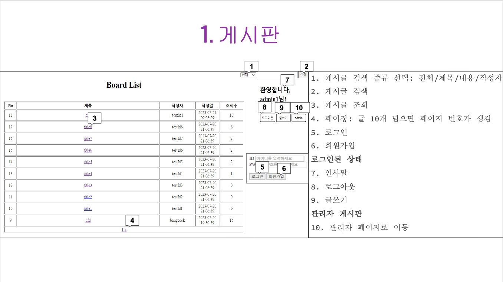

 

> **깃허브 주소** : [https://github.com/chocolaggibbiddori/mini-project2-best_board](https://github.com/chocolaggibbiddori/mini-project2-best_board)

## 개요

- 팀 이름 : Best Team
- 구성원 : 김훈호, 이준희, 명원식, 강동희

 

## 개발 표준

- 모든 문서는 UTF-8로 인코딩
- W3C 표준 문법 준수
- Java 변수명 및 파일명 : camel 기법
- DB 컬럼명 : snake 기법
- Servlet : post 처리 시 항상 redirect

 

## DB 설계

- DB : cafe
- Table : users

|   Field    |    Type     | Null |   Key   | Default |
|:----------:|:-----------:|:----:|:-------:|:-------:|
|  user_id   | varchar(20) |  NO  | PRIMARY |  NULL   |
|  user_pw   | varchar(20) |  NO  |         |  NULL   |
| user_name  | varchar(10) |  NO  |         |  NULL   |
|   email    | varchar(30) | YES  |         |  NULL   |
| user_grade |     int     | YES  |         |    5    |
|  approved  |   boolean   |  NO  |         |  FALSE  |
| join_date  |    date     |  NO  |         |  NULL   |

- Table : posts

|   Field    |    Type     | Null |   Key   | Default |     Extra      |
|:----------:|:-----------:|:----:|:-------:|:-------:|:--------------:|
|  post_id   |     int     |  NO  | PRIMARY |  NULL   | auto_increment |
|   title    | varchar(50) |  NO  |         |  NULL   |                |
|   writer   | varchar(20) |  NO  |         |  NULL   |                |
|  content   |    text     | YES  |         |  NULL   |                |
| post_grade |     int     | YES  |         |    4    |                |
|  reg_date  |  datetime   |  NO  |         |  NULL   |                |
|  mod_date  |  datetime   |  NO  |         |  NULL   |                |
|    hit     |     int     | YES  |         |    0    |                |

 

## 화면 설계

- 게시판

- 회원 가입

- 게시글 작성

- 게시글 조회

- 게시글 수정

- 관리자 페이지

 

## 프로젝트 구조

### 패키지

- dto : DTO 클래스들을 모아 놓은 패키지
  1. JoinUserDto
  2. ListDto
  3. ModifyPostDto
  4. PostDetailDto
  5. UserListDto
  6. WritePostDto

- repository : DB와 직접 통신하기 위한 패키지
  1. DBConnectionUtil
  2. PostRepository
  3. UserRepository

- service : Servlet과 repository 사이를 연결 시켜주는 로직이 담긴 패키지
  1. PostService
  2. UserService
  3. ValidationService

- servlet : 웹과 직접 통신하는 Servlet들을 모아 놓은 패키지
  1. AdminServlet
  2. IndexServlet
  3. JoinUserServlet
  4. LogCheckServlet
  5. ManageServlet
  6. PostDeleteServlet
  7. PostDetailServlet
  8. PostModifyServlet
  9. WritePostServlet

### webapp

- index.jsp
- logout.jsp

- admin
  1. applyList.jsp
  2. detailPost.jsp
  3. manage.jsp
  4. userList.jsp

- include
  1. adminBoard.jsp
  2. nonUserBoard.jsp
  3. userBoard.jsp

- post
  1. modifyPost.jsp
  2. writePost.jsp

- user
  1. detailPost.jsp
  2. join.jsp
  3. writerDetailPost.jsp

 

## Trouble Shooting

1. 도저히 알 수 없는 에러
   - 분명히 jsp 파일에는 문제가 없는 것 같은데 계속해서 오류가 나길래 해당 파일을 복사한 후 삭제했다가 다시 만들어줬더니 오류가 해결되었다...
2. SQLException: Illegal operation on empty result set.
   - ResultSet이 비어있길래 확인해봤더니 쿼리로 들어가는 변수가 모두 null인 것을 확인하였다.
   알고보니 파라미터 변수를 session.getAttribute()로 꺼내왔던 것! request.getParameter()로 고쳐주니 해결되었다.
3. NullPointerException
   - response.sendError() 메서드를 실행시키면 에러 페이지를 내보낸 후 메서드가 끝나는 줄 알았는데 아니였다..
   그 아래 코드까지 진행되는 와중에 NullPointerException이 터진 것. return;으로 해당 메서드를 끝내게 함으로써 해결하였다.
4. SQLException: Column 'post_grade' not found
   - 쿼리가 잘못되었다. user_grade를 post_grade라고 오타를 낸 것. 간단히 해결!

 

## 개선할 점

1. GitHub 사용 : GitHub를 사용하지 않으니 코드를 합치기가 굉장히 불편하였다.
2. 회의록 적극 활용 : 기껏 개발 전에 회의록 작성해놓고 잘 참고되지 않아서 이름이 꼬이는 등 문제가 발생하였다.
3. 주석 활용 : 다른 사람이 만든 코드를 이해하기 너무 어려웠다.

---
[<== 부트캠프 18일차](/bootcamp-day18) &nbsp;&nbsp;&nbsp;&nbsp;&nbsp;&nbsp;&nbsp;&nbsp; [부트캠프 23일차 ==>](/bootcamp-day23)