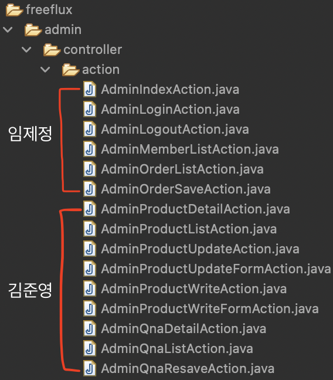
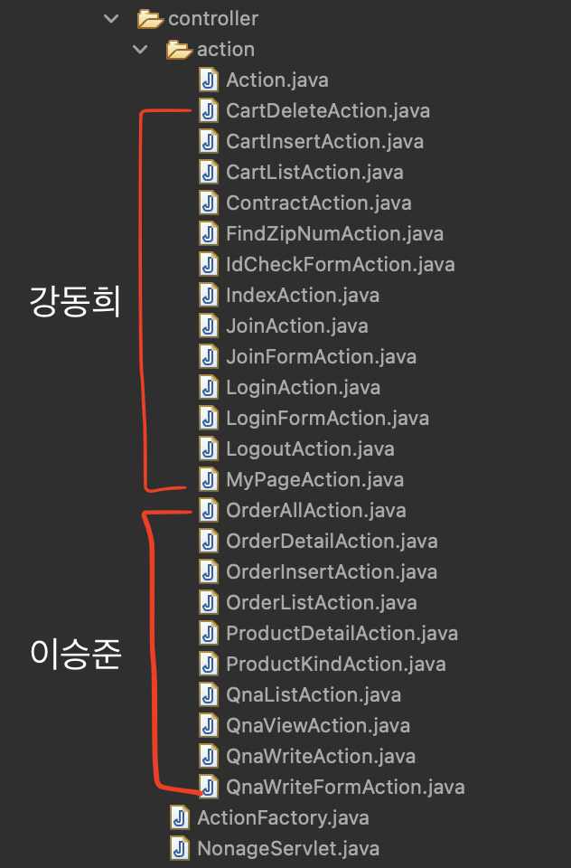
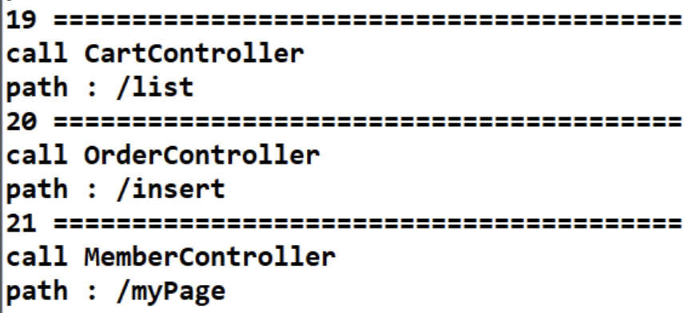

<br>

# 미니 프로젝트(withJ)

> **깃허브 주소** : [https://github.com/chocolaggibbiddori/mini-project3-shoppingmall](https://github.com/chocolaggibbiddori/mini-project3-shoppingmall)

<br>

## 목차

1. 기존 코드 분석
2. Service 클래스를 생성하여 비즈니스 로직을 분리
3. Action 클래스를 Controller 클래스로 변경
4. 리팩토링
5. 로그

<br>

### 기존 코드 분석

> 코드 분석

1. 모든 요청은 /NonageServlet 경로를 통해 처리됨
2. 각 요청은 command 파라미터를 통해 구분됨
3. 각 기능은 Action 클래스에 구현되어 있음

<br>

> MVC 패턴으로 변경하기 위해 해야 할 일

1. Action 클래스에 있는 비즈니스 로직을 Service 클래스로 추출
2. 유사한 요청들을 분리 및 처리하는 Controller 클래스 생성
3. 각 요청마다 url 경로를 알맞게 지정(jsp, js 내 경로 수정)

<br>

> 역할 분담



- 임제정

1. AdminLoginCheckController
2. AdminMemberListController
3. AdminOrderController

- 김준영

1. AdminProductController
2. AdminQnaController



- 강동희

1. CartController
2. IndexController
3. MemberController

- 이승준

1. OrderController
2. ProductController
3. QnaController

<br>

> 사전 협의 내용

- 이름을 잘 짓자(메서드, 변수, 파라미터 등)
- Service 클래스는 싱클톤으로 만들자
- 하나의 메서드에는 하나의 기능만 부여하자
- 각 클래스 및 메서드에 Javadoc 주석을 달자(코드를 읽어보지 않아도 사용 가능하게끔)
- 유사한 요청들은 하나의 Controller 클래스에서 처리하자
- Controller 클래스는 protected void service() 메서드를 구현하여 각 경로를 분리하도록 하자
- 각 기능은 Controller 클래스에서 메서드로 구현하자
- 요청 경로, 각 변수 등을 로그로 남기자

<br>

### 비즈니스 로직 분리

> service 패키지 생성


```java
/**
 * 아이디와 비밀번호를 검사하는 메서드
 * 아이디를 DB에서 확인해서 유저 객체로 받아온 후, 비밀번호를 비교한다.
 * 아이디가 DB에 저장되어 있지 않다면 유저 객체가 null이므로, 해당 객체를 null과 비교해서 아이디의 존재를 확인한다.
 * 아이디가 저장되어 있었다면 유저 객체에 비밀번호 값이 저장되어 있으므로, 그 값을 입력 받은 비밀번호와 비교한다.
 *
 * @param id 검사할 아이디
 * @param pwd 검사할 비밀번호
 * @return 아이디와 비밀번호가 DB에 저장된 값과 일치하면 true, 그렇지 않으면 false를 반환
 * @author kangdonghee
 */
public boolean isValidMember(String id, String pwd) {
    MemberVO memberVO = getMemberById(id);
    return memberVO != null && memberVO.getPwd().equals(pwd);
}
```

<br>

### Controller 클래스 생성

> Controller 클래스

```java
/**
 * 유저와 관련된 요청을 처리하는 컨트롤러
 * /action/member 이후의 경로를 통해 각각 알맞는 메서드를 호출하도록 구성함
 * 이 컨트롤러에서 처리 가능한 경로
 * 1. /findZipNum
 * 2. /idCheck
 * 3. /join
 * 4. /joinForm
 * 5. /login
 * 6. /loginForm
 * 7. /logout
 * 8. /myPage
 *
 * @author kangdonghee
 */
@WebServlet("/action/member/*")
public class MemberController extends HttpServlet {

    ...
    
    @Override
    protected void service(HttpServletRequest request, HttpServletResponse response) throws ServletException, IOException {
        String path = request.getPathInfo();
    
        Log.printClass(getClass());
        Log.printVariable("path", path);
    
        pathMapping(path, request, response);
    }
    
    private void pathMapping(String path, HttpServletRequest request, HttpServletResponse response) throws ServletException, IOException {
        switch (path) {
            case "/contract": contract(request, response); break;
            case "/findZipNum": findZipNum(request, response); break;
            case "/idCheck": idCheck(request, response); break;
            case "/join": join(request, response); break;
            case "/joinForm": joinForm(request, response); break;
            case "/login": login(request, response); break;
            case "/loginForm": loginForm(request, response); break;
            case "/logout": logout(request, response); break;
            case "/myPage": myPage(request, response); break;
            default: response.sendError(HttpServletResponse.SC_NOT_FOUND);
        }
    }
}
```

<br>

### 리팩토링

> 코드를 간결하게

|               리팩토링 전               |리팩토링 후|
|:----------------------------------:|:---:|
|||

> 메서드 추출

|                   리팩토링 전                   |                  리팩토링 후                  |
|:------------------------------------------:|:----------------------------------------:|
|  |  |

<br>

### 로그

> 로그 남기기



[<== 부트캠프 28일차](/bootcamp-day28) &nbsp;&nbsp;&nbsp;&nbsp;&nbsp;&nbsp;&nbsp;&nbsp; [부트캠프 35일차 ==>](/bootcamp-day35)