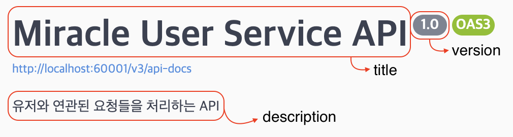
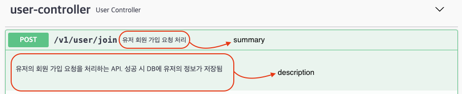
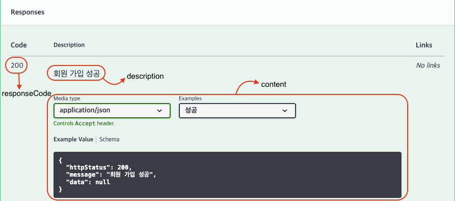
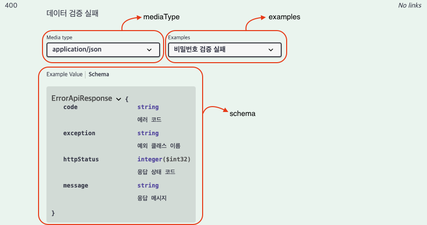
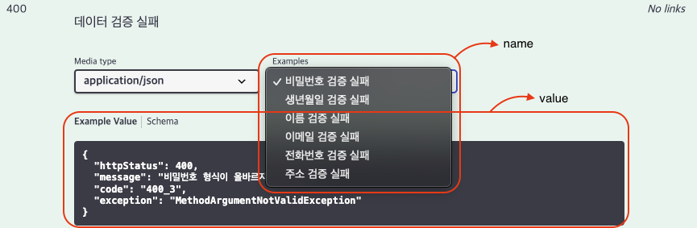
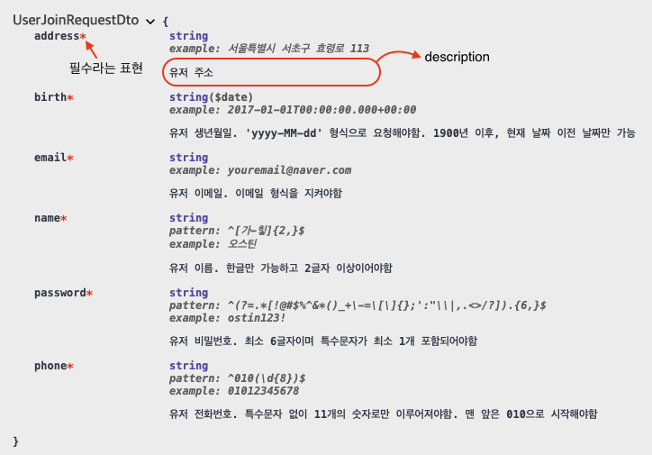

# Swagger 3.0.0을 이용한 API 명세 자동화

&nbsp;&nbsp; 최신 버전의 Swagger 라이브러리를 사용하기 위해 공부를 하였고, 책에 나와있는 2.9.2 버전과 다른 부분이 있어서 이를 공유하고자 이 글을 작성함

<br>

## 의존성 추가하기

&nbsp;&nbsp; `build.gradle` 파일에 다음과 같이 의존성을 추가한다.

```
implementation 'io.springfox:springfox-boot-starter:3.0.0'
```

<br>

## 설정 정보 추가하기

&nbsp;&nbsp; Swagger 라이브러리를 사용하기 위한 설정 정보를 추가해야한다.

> WebConfig.java

&nbsp;&nbsp; 이 설정 정보를 추가하지 않으면 다음 에러 메세지와 함께 `NullPointerException` 예외가 발생하고 애플리케이션이 실행되지 않는다. 정확히는 `@EnableWebMvc` 어노테이션이 필요함  
`Cannot invoke "org.springframework.web.servlet.mvc.condition.PatternsRequestCondition.getPatterns()" because "this.condition" is null`

```java
import org.springframework.context.annotation.Configuration;
import org.springframework.web.servlet.config.annotation.EnableWebMvc;

@EnableWebMvc
@Configuration
public class WebConfig {
}
```

<br>

> SwaggerConfig.java

&nbsp;&nbsp; 실제 Swagger 설정 정보가 포함되는 클래스. 기존의 `@EnableSwagger2` 대신에 `@EnableOpenApi` 어노테이션을 사용한다.
아래 코드는 사이드 프로젝트 진행 시 실제로 Swagger 설정으로 사용했던 코드이다.

```java
import com.fasterxml.classmate.TypeResolver;
import com.miracle.userservice.controller.response.ErrorApiResponse;
import com.miracle.userservice.controller.response.SuccessApiResponse;
import com.miracle.userservice.swagger.DefaultPathDocket;
import com.miracle.userservice.swagger.UserPathDocket;
import com.miracle.userservice.util.Const;
import org.springframework.context.annotation.Bean;
import org.springframework.context.annotation.Configuration;
import org.springframework.http.HttpMethod;
import org.springframework.http.HttpStatus;
import springfox.documentation.RequestHandler;
import springfox.documentation.builders.*;
import springfox.documentation.oas.annotations.EnableOpenApi;
import springfox.documentation.service.ApiInfo;
import springfox.documentation.service.ParameterType;
import springfox.documentation.service.RequestParameter;
import springfox.documentation.service.Response;
import springfox.documentation.spi.DocumentationType;
import springfox.documentation.spring.web.plugins.Docket;

import java.lang.annotation.Annotation;
import java.util.ArrayList;
import java.util.List;
import java.util.function.Predicate;

@EnableOpenApi
@Configuration
public class SwaggerConfig {

    private static final String TITLE = "Miracle User Service API";
    private static final String DESCRIPTION = "유저와 연관된 요청들을 처리하는 API";
    private static final String VERSION = "1.3";
    private static final String BASE_PACKAGE = "com.miracle.userservice.controller";

    @Bean
    public Docket defaultPathdocket(TypeResolver typeResolver) {
        return baseDocket(typeResolver, "default-path")
                .select()
                .apis(withAnnotation(DefaultPathDocket.class))
                .build();
    }

    @Bean
    public Docket userPathDocket(TypeResolver typeResolver) {
        return baseDocket(typeResolver, "user-path")
                .globalRequestParameters(userPathGlobalRequestParameterList())
                .globalResponses(HttpMethod.GET, userPathGlobalResponse())
                .globalResponses(HttpMethod.POST, userPathGlobalResponse())
                .globalResponses(HttpMethod.PUT, userPathGlobalResponse())
                .globalResponses(HttpMethod.DELETE, userPathGlobalResponse())
                .select()
                .apis(withAnnotation(UserPathDocket.class))
                .build();
    }

    private Docket baseDocket(TypeResolver typeResolver, String groupName) {
        return new Docket(DocumentationType.OAS_30)
                .globalRequestParameters(globalRequestParameterList())
                .globalResponses(HttpMethod.GET, globalResponse())
                .globalResponses(HttpMethod.POST, globalResponse())
                .globalResponses(HttpMethod.PUT, globalResponse())
                .globalResponses(HttpMethod.DELETE, globalResponse())
                .additionalModels(
                        typeResolver.resolve(SuccessApiResponse.class),
                        typeResolver.resolve(ErrorApiResponse.class)
                )
                .useDefaultResponseMessages(false)
                .apiInfo(apiInfo())
                .groupName(groupName)
                .select()
                .apis(RequestHandlerSelectors.basePackage(BASE_PACKAGE))
                .build();
    }

    private ApiInfo apiInfo() {
        return new ApiInfoBuilder()
                .title(TITLE)
                .description(DESCRIPTION)
                .version(VERSION)
                .build();
    }

    private List<RequestParameter> globalRequestParameterList() {
        List<RequestParameter> requestParameterList = new ArrayList<>();
        RequestParameter sessionId = new RequestParameterBuilder()
                .name(Const.RequestHeader.SESSION_ID)
                .in(ParameterType.HEADER)
                .required(Boolean.TRUE)
                .build();
        RequestParameter miracle = new RequestParameterBuilder()
                .name(Const.RequestHeader.MIRACLE)
                .in(ParameterType.HEADER)
                .required(Boolean.TRUE)
                .build();

        requestParameterList.add(sessionId);
        requestParameterList.add(miracle);
        return requestParameterList;
    }

    private List<RequestParameter> userPathGlobalRequestParameterList() {
        List<RequestParameter> requestParameterList = new ArrayList<>();
        RequestParameter userId = new RequestParameterBuilder()
                .name(Const.RequestHeader.USER_ID)
                .in(ParameterType.HEADER)
                .required(Boolean.TRUE)
                .build();

        requestParameterList.add(userId);
        return requestParameterList;
    }

    private List<Response> globalResponse() {
        List<Response> responseList = new ArrayList<>();
        Response response = new ResponseBuilder()
                .code("401")
                .description("비정상적인 요청")
                .isDefault(true)
                .examples(
                        List.of(new ExampleBuilder()
                                .id("1")
                                .mediaType("application/json")
                                .summary("토큰 인증 실패")
                                .value(new ErrorApiResponse(
                                        HttpStatus.UNAUTHORIZED.value(),
                                        "올바르지 않은 요청입니다.",
                                        "401",
                                        "InvalidRequestStateException"))
                                .build()
                        )
                )
                .build();

        responseList.add(response);
        return responseList;
    }

    private List<Response> userPathGlobalResponse() {
        List<Response> responseList = globalResponse();
        Response userForbidden = new ResponseBuilder()
                .code("403")
                .description("비정상적인 요청")
                .isDefault(true)
                .examples(
                        List.of(new ExampleBuilder()
                                .id("1")
                                .mediaType("application/json")
                                .summary("유저 검증 실패")
                                .value(new ErrorApiResponse(
                                        HttpStatus.FORBIDDEN.value(),
                                        "허가되지 않는 요청입니다.",
                                        "403",
                                        "UserIdMismatchException"))
                                .build()
                        )
                )
                .build();

        Response userBadRequest = new ResponseBuilder()
                .code("400")
                .description("잘못된 요청")
                .isDefault(true)
                .examples(
                        List.of(new ExampleBuilder()
                                .id("1")
                                .mediaType("application/json")
                                .summary("유저가 존재하지 않음")
                                .value(new ErrorApiResponse(
                                        HttpStatus.BAD_REQUEST.value(),
                                        "해당 유저를 찾을 수 없습니다.",
                                        "400",
                                        "NoSuchUserException"))
                                .build()
                        )
                )
                .build();

        responseList.add(userForbidden);
        responseList.add(userBadRequest);
        return responseList;
    }

    private Predicate<RequestHandler> withAnnotation(Class<? extends Annotation> annotation) {
        Class<? extends Annotation> other = annotation.equals(DefaultPathDocket.class) ? UserPathDocket.class : DefaultPathDocket.class;
        return RequestHandlerSelectors.withMethodAnnotation(annotation)
                .or(
                        RequestHandlerSelectors.withMethodAnnotation(other).negate()
                            .and(RequestHandlerSelectors.withClassAnnotation(annotation))
                );
    }
}
```

### Docket

&nbsp;&nbsp; Swagger API 명세서. Docket 객체를 스프링 빈으로 등록하여 API 명세서를 만들 수 있고 해당 빈은 여러 개 등록할 수 있으며 Docket 객체 하나당 하나의 명세를 나타낸다.
Docket 객체를 여러 개 등록할 경우 반드시 `groupName`을 지정해 주어 구분해야 한다. 위 코드에서는 두 개의 명세서를 사용하기 위해 Docket 빈을 2개 등록하고있다.

#### 생성자

- DocumentationType : Docket 생성자 매개변수. Swagger 버전에 맞는 타입을 지정해주면 된다. Swagger 3.0.0 버전을 사용하므로 `SWAGGER_2` 대신 `OAS_30`을 사용한다.

#### 메서드

- globalRequestParameters(List\<RequestParameter> globalRequestParameters) : 해당 명세에 나타나는 모든 API 명세에 적용할 요청 파라미터를 설정하는 메서드. 매개변수로 파라미터들을 넣어준다. 아래는 요청 파라미터를 생성하는 예시

   ```java
   private List<RequestParameter> globalRequestParameterList() {
       List<RequestParameter> requestParameterList = new ArrayList<>();
       RequestParameter sessionId = new RequestParameterBuilder()
               .name(Const.RequestHeader.SESSION_ID)
               .in(ParameterType.HEADER)
               .required(Boolean.TRUE)
               .build();
       RequestParameter miracle = new RequestParameterBuilder()
               .name(Const.RequestHeader.MIRACLE)
               .in(ParameterType.HEADER)
               .required(Boolean.TRUE)
               .build();
   
       requestParameterList.add(sessionId);
       requestParameterList.add(miracle);
       return requestParameterList;
   }
   ```

- globalResponses(HttpMethod httpMethod, List\<Response> responses) : 해당 명세에 나타나는 모든 API 명세에 적용할 응답을 설정하는 메서드. HTTP 메서드 별로 설정할 수 있다. 아래는 응답을 생성하는 예시

   ```java
   private List<Response> globalResponse() {
       List<Response> responseList = new ArrayList<>();
       Response response = new ResponseBuilder()
               .code("401")
               .description("비정상적인 요청")
               .isDefault(true)
               .examples(
                       List.of(new ExampleBuilder()
                               .id("1") // id를 지정하지 않으면 제대로 동작하지 않는다. Example이 여러 개일 경우 각 예시를 구분해주는 값
                               .mediaType("application/json")
                               .summary("토큰 인증 실패")
                               .value(new ErrorApiResponse(
                                       HttpStatus.UNAUTHORIZED.value(),
                                       "올바르지 않은 요청입니다.",
                                       "401",
                                       "InvalidRequestStateException"))
                               .build()
                       )
               )
               .build();
   
       responseList.add(response);
       return responseList;
   }
   ```

- additionalModels : Swagger가 해당 객체를 모델링 할 수 있도록 명시 (API 명세 화면 상단에 `Could not resolve reference: undefined undefined` 에러가 표시된다면 이 메서드에 해당 객체를 추가해 주어야 함). 자세한 사용 방법은 상기 코드를 참조
- useDefaultResponseMessages(boolean apply) : API 문서에서 기본적인 응답을 표시할 지 설정. false로 설정하지 않으면 201, 400, 401 등 우리가 명시하지 않는 응답 코드가 자동으로 표시됨
- apiInfo(ApiInfo apiInfo) : 해당 명세서의 기본적인 정보를 담는 메서드. API 문서의 최상단에 표시됨
- groupName(String groupName) : 해당 명세서의 이름을 지정. Docket 객체를 여러 개 빈으로 등록할 경우 반드시 지정해 주어야 함
- select() : Docket 설정을 마치고 API 설정을 할 수 있도록 `ApiSelectorBuilder` 객체를 반환하는 메서드

### ApiSelectorBuilder

&nbsp;&nbsp; Docket 설정 후 `select()` 메서드를 호출하게 되면 반환되는 클래스. 해당 Docket에 어떤 API를 적용할 지 설정할 수 있다.

- apis(Predicate\<RequestHandler> selector) : 문서화 할 핸들러 조건을 설정하는 메서드. `RequestHandlerSelectors` 클래스를 통해 쉽게 입력할 수 있다. `selector` 조건이 `true`를 반환하는 API만 해당 명세서에 표시된다. 
- paths(Predicate\<String> selector) : 문서화 할 요청 경로 조건을 설정하는 메서드. `PathSelectors` 클래스를 통해 쉽게 입력할 수 있다. `selector` 조건이 `true`를 반환하는 API만 해당 명세서에 표시된다.

### ApiInfo

&nbsp;&nbsp; Docket의 `apiInfo()` 메서드의 매개변수로 넣어주는 클래스. 해당 객체를 통해 명세서의 기본 정보를 표시할 수 있다.

- title(String title) : 명세서 제목
- description(String description) : 명세서 설명
- version(String version) : 명세서 버전



&nbsp;&nbsp; 이외에 각 메서드에 매개변수로 어떤 값이 들어가는지 등의 정보는 해당 클래스 혹은 메서드 문서를 보거나, 상기 코드를 보면 쉽게 유추 가능하다.

<br>

## API 정보 표시하기

### @Operation

&nbsp;&nbsp; API의 정보를 표현하는 어노테이션. 메서드 레벨에서 사용함

- summary : 해당 API의 요약 설명
- description : 해당 API의 상세 설명
- responses : 여러 응답에 대한 정보. `@ApiResponse` 어노테이션이 사용됨. 여러 개인 경우 배열로 넣어줌



<br>

### @ApiResponse

&nbsp;&nbsp; API 응답 정보를 표현하는 어노테이션

- responseCode : 응답 상태 코드
- description : 해당 응답의 설명
- content : 해당 응답의 내용. `@Content` 어노테이션을 사용



<br>

### @Content

&nbsp;&nbsp; API 내용을 표현하는 어노테이션

- medieType : 미디어 타입
- examples : 예시 표현들. `@ExampleObject` 어노테이션을 사용. 여러 개인 경우 배열로 넣어줌
- schema : 스키마 표현. `@Schema` 어노테이션을 사용



<br>

### @ExampleObject

&nbsp;&nbsp; 해당 응답에 대한 여러 예시들을 표현하는 어노테이션

- name : 해당 예시의 이름
- value : 예시 값



<br>

### @Schema

&nbsp;&nbsp; 스키마 정보를 설정하는 어노테이션

- implementation : 스키마 정보로 해당 객체를 인용함
- description : 해당 스키마의 설명
- required : 필수 여부
- example : 예시



<br>

## 사용 예시

### API 정보

```java
@Operation(
        summary = "유저 회원 가입 요청 처리",
        description = "유저의 회원 가입 요청을 처리하는 API. 성공 시 DB에 유저의 정보가 저장됨",
        responses = {
                @ApiResponse(
                        responseCode = "200",
                        description = "회원 가입 성공",
                        content = @Content(
                                mediaType = "application/json",
                                examples = @ExampleObject(
                                        name = "성공",
                                        value = """
                                                {
                                                  "httpStatus": 200,
                                                  "message": "회원 가입 성공",
                                                  "data": null
                                                }
                                                """
                                ),
                                schema = @Schema(implementation = SuccessApiResponse.class)
                        )
                ),
                @ApiResponse(
                        responseCode = "400",
                        description = "데이터 검증 실패",
                        content = @Content(
                                mediaType = "application/json",
                                examples = {
                                        @ExampleObject(
                                                name = "이메일 검증 실패",
                                                value = """
                                                        {
                                                          "httpStatus": 400,
                                                          "message": "이메일 형식이 올바르지 않습니다.",
                                                          "code": "400_1",
                                                          "exception": "MethodArgumentNotValidException"
                                                        }
                                                        """
                                        ),
                                        @ExampleObject(
                                                name = "이름 검증 실패",
                                                value = """
                                                        {
                                                          "httpStatus": 400,
                                                          "message": "이름 형식이 올바르지 않습니다.",
                                                          "code": "400_2",
                                                          "exception": "MethodArgumentNotValidException"
                                                        }
                                                        """
                                        ),
                                        @ExampleObject(
                                                name = "비밀번호 검증 실패",
                                                value = """
                                                        {
                                                          "httpStatus": 400,
                                                          "message": "비밀번호 형식이 올바르지 않습니다.",
                                                          "code": "400_3",
                                                          "exception": "MethodArgumentNotValidException"
                                                        }
                                                        """
                                        ),
                                        @ExampleObject(
                                                name = "전화번호 검증 실패",
                                                value = """
                                                        {
                                                          "httpStatus": 400,
                                                          "message": "전화번호 형식이 올바르지 않습니다.",
                                                          "code": "400_4",
                                                          "exception": "MethodArgumentNotValidException"
                                                        }
                                                        """
                                        ),
                                        @ExampleObject(
                                                name = "생년월일 검증 실패",
                                                value = """
                                                        {
                                                          "httpStatus": 400,
                                                          "message": "생년월일 형식이 올바르지 않습니다.",
                                                          "code": "400_5",
                                                          "exception": "MethodArgumentNotValidException"
                                                        }
                                                        """
                                        ),
                                        @ExampleObject(
                                                name = "주소 검증 실패",
                                                value = """
                                                        {
                                                          "httpStatus": 400,
                                                          "message": "주소 형식이 올바르지 않습니다.",
                                                          "code": "400_6",
                                                          "exception": "MethodArgumentNotValidException"
                                                        }
                                                        """
                                        )
                                },
                                schema = @Schema(implementation = ErrorApiResponse.class)
                        )
                ),
                @ApiResponse(
                        responseCode = "401",
                        description = "비정상적인 요청",
                        content = @Content(
                                mediaType = "application/json",
                                examples = @ExampleObject(
                                        name = "토큰 검증 실패",
                                        value = """
                                                {
                                                  "httpStatus": 401,
                                                  "message": "올바르지 않은 요청입니다.",
                                                  "code": "401",
                                                  "exception": "InvalidRequestStateException"
                                                }
                                                """
                                ),
                                schema = @Schema(implementation = ErrorApiResponse.class)
                        )
                )
        }
)
```

### Schema 정보

```java
@Data
public class UserJoinRequestDto {

    @Schema(
            description = "유저 이메일. 이메일 형식을 지켜야함",
            required = true,
            example = "youremail@naver.com"
    )
    @Email(message = ValidationDefaultMsgUtil.EMAIL)
    @NotBlank(message = ValidationDefaultMsgUtil.EMAIL)
    private final String email;

    @Schema(
            description = "유저 이름. 한글만 가능하고 2글자 이상이어야함",
            required = true,
            example = "오스틴"
    )
    @Pattern(regexp = "^[가-힣]{2,}$", message = ValidationDefaultMsgUtil.NAME)
    @NotBlank(message = ValidationDefaultMsgUtil.NAME)
    private final String name;

    @Schema(
            description = "유저 비밀번호. 최소 6글자이며 특수문자가 최소 1개 포함되어야함",
            required = true,
            example = "ostin123!"
    )
    @Pattern(regexp = "^(?=.*[!@#$%^&*()_+\\-=\\[\\]{};':\"\\\\|,.<>/?]).{6,}$", message = ValidationDefaultMsgUtil.PASSWORD)
    @NotBlank(message = ValidationDefaultMsgUtil.PASSWORD)
    private final String password;

    @Schema(
            description = "유저 전화번호. 특수문자 없이 11개의 숫자로만 이루어져야함. 맨 앞은 010으로 시작해야함",
            required = true,
            example = "01012345678"
    )
    @Pattern(regexp = "^010(\\d{8})$", message = ValidationDefaultMsgUtil.PHONE)
    @NotBlank(message = ValidationDefaultMsgUtil.PHONE)
    private final String phone;

    @Schema(
            description = "유저 생년월일. 'yyyy-MM-dd' 형식으로 요청해야함. 1900년 이후, 현재 날짜 이전 날짜만 가능",
            required = true,
            example = "2017-01-01"
    )
    @Birth(message = ValidationDefaultMsgUtil.BIRTH)
    private final LocalDate birth;

    @Schema(
            description = "유저 주소",
            required = true,
            example = "서울특별시 서초구 효령로 113"
    )
    @NotBlank(message = ValidationDefaultMsgUtil.ADDRESS)
    private final String address;
}
```

<br>

## API 문서 공유 방법

1. 애플리케이션 실행
2. `{ip}:{post}/swagger-ui/index.html` 경로로 이동  
   `ex) localhost:8080/swagger-ui/index.html`
3. API 제목 아래에 있는 링크 클릭  
   `ex) http://localhost:8080/v3/api-docs`
4. json 데이터 복사
5. 복사한 데이터를 공유

<br>

## API 문서 보는 방법

1. [Swagger Editor](https://editor-next.swagger.io/)로 이동
2. 복사한 json 데이터 붙여넣기