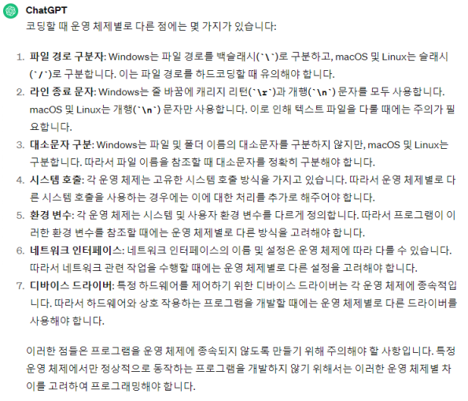
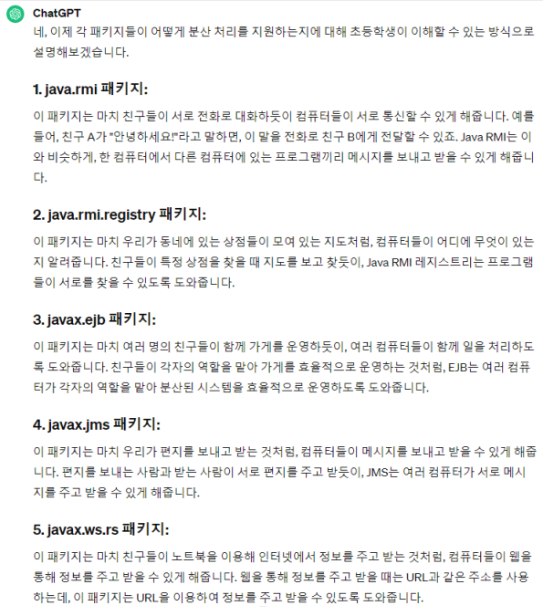

# Java 이해 및 개발 시작


<br>
&nbsp; 미루고 미루던 Java의 정석 정리하기~ <br>
성격상 모르는 건 파고 들어가는데, 1장에서 가장 방대한 내용이 등장하더라구요,,^^> 그냥 겉핥기만 하려구요.<br>
아는 건 빼고, 기억 잘 못하는 재밌는 내용만 정리합니다.

# 이해하기

## 특징
### 1. 운영체제(OS)에 독립적
&nbsp; [Java application은 JVM과 통신하면 됩니다.]<br>


&nbsp; Windows, mac, Linux 등 OS는 하드웨어와 Application(응용 프로그램) 사이를 중재합니다.
응용 프로그램은 OS가 제공하는 API를 사용해 네트워크 통신, 파일 시스템, 메모리 할당 등 실질적인 하드웨어 자원에 접근할 수 있는 거죠.

&nbsp; 여기서 OS마다 동작 방식이 조금씩 다릅니다.<br>
<br>
이에 따라 OS에 종속적인 프로그래밍 언어가 있을 수 있고, 종속되지는 않더라도 다양한 플랫폼에서 실행하기 위해 약간은 신경을 써야 할 부분이 더러 있습니다.
예를 들어 C나 C++은 코드 내에서 특정 OS에 따라 코드 블록을 컴파일해 OS에 맞는 API를 호출하기도 합니다.

&nbsp; Java가 독립적일 수 있는 이유는 Java Application 계층과 OS 계층 사이에 JVM을 추가했기 때문입니다.
이렇게 하면 Java는 JVM에만 의존하고, Java로 작성된 프로그램은 OS나 하드웨어와 관게없이 어디서든 실행 가능해집니다.
물론 JVM은 OS에 종속적이기 때문에
썬<span style="color: #808080">(*현재는 오라클에 인수된 Java를 개발한 회사*)</span>에서 
각 운영체제에 설치할 수 있는 JVM을 제공하구요.
계층을 추가해 개발자가 Java로 작성할 때 고려할 사항을 줄인 거죠.

&nbsp; 따라서 "Write once, run anywhere" 자바로 작성된 프로그램은 한 번 작성하면, 운영체제와 상관없이 어디서든 실행할 수 있습니다.
<br><br>

### 2. 객체지향언어(OOP)
&nbsp; [Object Oriented Programing language]

&nbsp; 상속, 캡슐화, 다형성이 잘 적용된 순수한 객체지향 언어라는 평가를 받습니다.

&nbsp; 모든 것을 객체로 다뤄야 하지만 8개의 기본형(boolean, char, byte, short, int, long, float, double)은 객체로 다루지 않아 Java가 완전한 객체지향 언어가 아니라는 얘기를 듣기도 합니다. 
 물론 각각에 해당하는 wrapper 클래스가 있지만 성능 면에서는 기본형이 더 좋겠죠? JVM 내부에서 기본형 데이터 타입이 효율적으로 처리되거든요.
Java 5부터는 오토박싱과 오토언박싱을 지원하지만 이 역시 성능을 고려해서 설계하면 좋을 것 같습니다.
<br><br>

### 3. 배우기 쉬움
&nbsp; 두 언어에서 장점을 취하고, 단순화했기 때문에 쉽게 배울 수 있습니다.
<br>"C++"에서 연산자와 기본 구문을, "small talk"에서 객체지향관련 구문을 가져왔습니다.
복잡하고 불필요하다고 생각하는 부분을 삭제했고요. 개인적으로 저는 바보라서 이 특징에는 동의할 수 없습니다.
<br><br>

### 4. Garbage Collection(자동 메모리 관리)
&nbsp; [Garbage collector]

&nbsp; 자바 응용 프로그램이 실행되면, 프로그래머는 메모리를 따로 관리하지 않아도 됩니다. "Garbage Collector"가 자동으로 메모리를 관리해 주거든요.
물론 자동이라는 편리한 단어는 어느 정도의 성능 저하를 불러올 수는 있지만 중요한 로직에만 집중할 수 있는 환경에 우선순위를 둔 것 같습니다.

&nbsp; 다음은 Garbage Collector가 없는 C언어를 사용해 동적 메모리를 할당해 정수를 저장하는 코드입니다.

```C
#include <stdio.h>
#include <stdlib.h>

int main() {
  int *value = (int*)malloc(sizeof(int));
  
  if (value == NULL) {
    printf("메모리 할당 실패");
    return 1;
  }
  
  *value = 10;
  printf("값 = %d", *value);
  
  free(value);
  return 0;
}
```

`malloc()`이 파라미터에 해당하는 크기만큼 메모리를 할당해 줍니다.<br>
사용을 마친 후, 메모리 누수 방지를 위해 해당 메모리를 `free()` 함수를 이용해 메모리를 해제해야 합니다.

&nbsp; 다음은 이에 대응하는 java 코드입니다. 읽기 편하네요.
```java
public class Main {
    public static void main(String[] args) {
        Integer value = new Integer(10);
        
        System.out.printLn("값 = " + value);
    }
}
```
&nbsp; Garbage collector는 정기적으로 실행되거나 객체가 할당된 Heap 메모리가 부족할 때 실행되며, 다양한 알고리즘으로 동작합니다.
JVM에서 사용하는 친구인데 다음에 더 깊게 공부할 예정이지롱
<br><br>

### 5. 네트워크와 분산 처리
&nbsp; 다양한 네트워크 프로그래밍 라이브러리(Java API) 제공

&nbsp; 먼저 네트워크 관련 기능은 `java.net` 패키지에 잔뜩 있습니다. 소켓 통신, HTTP 통신 등의 기능이 있습니다.
그리고 분산 처리 관련 기능은 `java.rmi` 패키지와 `javax`의 `ejb`, `jms`, `ws.rs` 패키지가 있다고 합니다.

&nbsp; 분산 처리가 한 작업을 분산해 작은 책임을 갖고 효율적으로 처리하는 것이라해도, 저는!!! 멍청해서,, 와닿지 않아요.
chatGPT 형님께 도움을 청했습니다.<br>
<br>
쿸,, 다음!
<br><br>

### 6. 멀티쓰레드(multi-thread) 지원
&nbsp; 관련 라이브러리(Java API) 제공

&nbsp; 먼저, 일반적인 멀티쓰레드 지원은 OS에 따라 구현방법과 처리 방식이 다릅니다. 하지만 아시다시피 Java는 JVM 덕분에 OS에 종속되지 않죠!
 JVM은 여러 쓰레드에 대한 scheduling도 담당합니다.
게다가 `java.lang.Thread` class, `java.util.concurrent` 패키지 등 멀티쓰레드 관련 라이브러리(Java API)가 제공됩니다.


### 7. 동적 로딩 지원

4. **Dynamic Loading** 지원
   - 실행 시, 필요 시점에 클래스 로딩 가능*(=일부만 컴파일 가능)*


5. **Garbage Collection** (자동 메모리 관리)
   - 사용이 끝난 Object 알려주기: `ObjectName = null;`
   - Object 강제 회수: `System.gc();`
   - 객체 소멸 시, 실행할 코드: 클래스 내에 `finalize()` 재정의 → Object 제거 전 중요 Data 저장


## JDK
### JRE
### JVM
### JavaAPI

# 개발 시작
## 개발 환경 구축
## 실행 과정