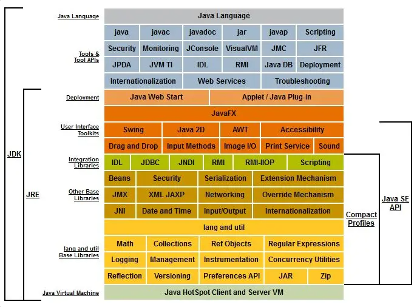
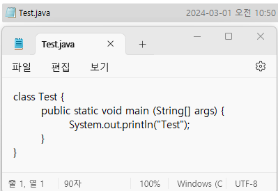

# Java 이해 및 개발 시작


<br>
아는 건 빼거나 대강 넘어가고, 기억 잘 못하는 재밌는 내용만 정리합니다.

# 이해하기

## 특징
### 1. 운영체제(OS)에 독립적
&nbsp; [Java application은 JVM과 통신하면 됩니다.]<br>


&nbsp; Windows, mac, Linux 등 OS는 하드웨어와 Application(응용 프로그램) 사이를 중재합니다.
응용 프로그램은 OS가 제공하는 API를 사용해 네트워크 통신, 파일 시스템, 메모리 할당 등 실질적인 하드웨어 자원에 접근할 수 있는 거죠.

&nbsp; 여기서 OS마다 동작 방식이 조금씩 다고 해서 GPT에게 물어봤습니다.<br>
<br>
<br>
<br>
&nbsp; 이에 따라 OS에 종속적인 프로그래밍 언어가 있을 수 있고, 종속되지는 않더라도 다양한 플랫폼(운영체제나 하드웨어)에서 실행하기 위해 신경을 써야 할 부분이 더러 있습니다.
예를 들어 C나 C++은 코드 내에서 특정 OS에 따라 코드 블록을 컴파일해 OS에 맞는 API를 호출하기도 합니다.

&nbsp; Java가 독립적일 수 있는 이유는 Java Application 계층과 OS 계층 사이에 JVM을 추가했기 때문입니다.<br>
이렇게 하면 Java는 JVM에만 의존하고, Java로 작성된 프로그램은 OS나 하드웨어와 관게없이 어디서든 실행 가능해집니다.
물론 JVM은 OS에 종속적이기 때문에
썬<span style="color: #808080">(*현재는 오라클에 인수된 Java를 개발한 회사*)</span>에서 
각 운영체제에 설치할 수 있는 JVM을 제공하구요.<br>
계층을 추가해 개발자가 Java로 작성할 때 고려할 사항을 줄인 거죠.

&nbsp; 따라서 "Write once, run anywhere" 자바로 작성된 프로그램은 한 번 작성하면, 운영체제와 상관없이 어디서든 실행할 수 있습니다.
<br><br>

### 2. 객체지향언어(OOP)
&nbsp; [Object Oriented Programing language]

&nbsp; 상속, 캡슐화, 다형성이 잘 적용된 순수한 객체지향 언어라는 평가를 받습니다.

&nbsp; 참고로 모든 것을 객체로 다뤄야 하지만 8개의 기본형(boolean, char, byte, short, int, long, float, double)은 객체로 다루지 않아 Java가 완전한 객체지향 언어가 아니라는 얘기를 듣기도 합니다. 
 물론 각각에 해당하는 wrapper 클래스가 있지만 성능 면에서는 기본형이 더 좋겠죠? JVM 내부에서 기본형 데이터 타입이 효율적으로 처리되거든요.
Java 5부터는 오토박싱과 오토언박싱을 지원하지만 이 역시 성능을 고려해서 설계하면 좋을 것 같습니다.
<br><br>

### 3. 배우기 쉬움
&nbsp; 두 언어에서 장점을 취하고, 단순화했기 때문에 쉽게 배울 수 있습니다.
<br>"C++"에서 연산자와 기본 구문을, "small talk"에서 객체지향관련 구문을 가져왔습니다.
복잡하고 불필요하다고 생각하는 부분을 삭제했고요. 개인적으로 저는 바보라서 이 특징에는 동의할 수 없습니다.
<br><br>

### 4. Garbage Collection(자동 메모리 관리)
&nbsp; [Garbage collector]

&nbsp; 자바 응용 프로그램이 실행되면, 프로그래머는 메모리를 따로 관리하지 않아도 됩니다. "Garbage Collector"가 자동으로 메모리를 관리해 주거든요.
물론 자동이라는 편리한 단어는 어느 정도의 성능 저하를 불러올 수는 있지만 중요한 로직에만 집중할 수 있는 환경에 우선순위를 둔 것 같습니다.

&nbsp; 다음은 Garbage Collector가 없는 C언어를 사용해 동적 메모리를 할당해 정수를 저장하는 코드입니다.

```bash
#include <stdio.h>
#include <stdlib.h>

int main() {
  int *value = (int*)malloc(sizeof(int));
  
  if (value == NULL) {
    printf("메모리 할당 실패");
    return 1;
  }
  
  *value = 10;
  printf("값 = %d", *value);
  
  free(value);
  return 0;
}
```

`malloc()`이 파라미터에 해당하는 크기만큼 메모리를 할당해 줍니다.<br>
사용을 마친 후, 메모리 누수 방지를 위해 해당 메모리를 `free()` 함수를 이용해 메모리를 해제해야 합니다.

&nbsp; 다음은 이에 대응하는 java 코드입니다. 읽기 편하네요.
```java
public class Main {
    public static void main(String[] args) {
        Integer value = new Integer(10);
        
        System.out.printLn("값 = " + value);
    }
}
```
&nbsp; Garbage collector는 정기적으로 실행되거나 객체가 할당된 Heap 메모리가 부족할 때 실행되며, 다양한 알고리즘으로 동작합니다.
JVM에서 사용하는 친구인데 다음에 더 깊게 공부할 예정이지롱

&nbsp; 참고로 다음의 방법으로 Garbage collector를 수동 조정할 수도 있습니다.
- 사용이 끝난 Object 알려주기: `ObjectName = null;`
- Object 강제 회수: `System.gc();`
- 객체 소멸 시, 실행할 코드: 클래스 내에 `finalize()` 재정의 → *Object 제거 전 중요 Data 저장 가능*
<br><br>

### 5. 네트워크와 분산 처리
&nbsp; [다양한 네트워크 프로그래밍 라이브러리(Java API) 제공]

&nbsp; 먼저 네트워크 관련 기능은 `java.net` 패키지에 잔뜩 있습니다. 소켓 통신, HTTP 통신 등의 기능이 있습니다.
그리고 분산 처리 관련 기능은 `java.rmi` 패키지와 `javax`의 `ejb`, `jms`, `ws.rs` 패키지가 있다고 합니다.

&nbsp; 분산 처리가 한 작업을 분산해 작은 책임을 갖고 효율적으로 처리하는 것이라해도, 저는!!! 멍청해서,, 와닿지 않아요.<br>
GPT 선생님의 패키지별 분산 처리 지원 내용을 봅시다.<br>
<br>
<br>
<br>
쿸,, 다음!
<br><br>

### 6. 멀티쓰레드(multi-thread) 지원
&nbsp; [멀티쓰레드 관련 라이브러리(Java API) 제공]

&nbsp; 먼저, 일반적인 멀티쓰레드 지원은 OS에 따라 구현방법과 처리 방식이 다릅니다. <br>
하지만 아시다시피 Java는 JVM 덕분에 OS에 종속되지 않죠!
 JVM은 여러 쓰레드에 대한 scheduling도 담당합니다.
게다가 `java.lang.Thread` class, `java.util.concurrent` 패키지 등 멀티쓰레드 관련 라이브러리(Java API)가 제공됩니다.

&nbsp; 참고로 scheduling은 말 그대로 쓰레드를 어떤 순서로 실행할 지 결정하는 작업입니다.
CPU는 제한되어 있으니 야무지게 할당해야 효율적으로 사용할 수 있잖아요. 여기에도 다양한 알고리즘이 사용된다고 합니다.
<br><br>

### 7. 동적 로딩 지원
&nbsp; 실행 시, 필요 시점에 클래스를 로딩합니다.

&nbsp; Java는 보통 여러 개의 클래스 파일로 구성됩니다.<br>
 이 클래스들이 실행 시점에 모두 로딩되지 않고 사용되는 시점에서 각 클래스를 로딩해 사용해요.<br>
따라서 유연성이 높아지고 메모리를 효율적으로 관리할 수 있습니다.
이게 동적 로딩을 지원해서 가능한 일인데, 장점이 더 있어요.
일부 클래스가 변경되어도 해당 부분만 컴파일이 가능합니다. 그렇기에 애플리케이션에 변경사항이 발생해도 비교적 적은 작업만으로 처리할 수 있답니다.
<br>

# JDK

&nbsp; 개인적으로 처음 Java에 발을 들였을 때, 오잉? 했던 부분입니다. Java를 다운로드 하려했더니 JDK를 다운로드하라는 거에요.
진짜 띠용이었지만 그때는 그냥 시키는 대로 했습니다.<br>
Java Development Kit, JDK는 자바로 개발하는데 필요한 도구들을 하나로 묶어 둔 것입니다.<br>

<br>
[JavaSE 8](https://docs.oracle.com/javase/8/docs/)

진짜 많지만 주요한 도구만 보도록 하겠습니다.

## 실행 파일
&nbsp; IntelliJ에서 초록색 세모만 딸깍하면 돼서 자각하지 못했는데, 
실제로 실행이라는 건 사람이 해석할 수 있는 코드를 작성한다고 끝나지 않습니다.<br>

&nbsp; 사람의 코드를 해석해서 기계가 이해하는 코드로 변환해야 하죠. 심지어 자바는 JVM이라는 가상의 기계가 중간에 있기 때문에 이 과정을 2번 해야해요.<br>
 그러니까 Java 코드를 Compile해서 JVM이 이해할 수 있는 바이트 코드로 바꾸고, JVM은 이 바이트 코드를 Interpreter로 해석 해서 OS를 실행할 명령어를 생성해야 실제로 작동하는 겁니다.<br>
이를 위한 실행 파일들은 JDK 설치 시, bin 디렉토리 내부에 존재합니다. 

&nbsp; 주요한 실행 파일을 테스트 하기위해 다음의 코드를 작성했습니다.
```java
class Test {
	public static void main (String[] args) {
		System.out.println("Test");
	}
}
```
<br>
<br>

### `javac.exe`: 자바 컴파일러
&nbsp; 작성한 <span style="background-color: #808080">java source code</span>를 JVM이 이해할 수 있는 <span style="background-color: #808080">byte code</span>로 컴파일합니다.<br>
- 대상: `.java` 파일
  ```bash
    > javac Test.java
  ```
- 실행: `.class` 파일 생성(byte code로 이루어짐)

&nbsp; 여기서 `.java`는 저희가 작성하는 Java, 사람의 코드로 이루어진 Java Source 파일입니다.
`.class`는 JVM이 이해할 수 있는 byte code, 기계어로 이루어져 있는 파일이구요. 
실제로 Java application은 여러 개의 class로 구성되어 있으며 하나의 class에서도 상속, 내부 클래스 등 여러 class 정보가 필요할 수 있습니다.
애플리케이션을 실행하기 위해 컴파일러는 필요한 만큼의 클래스 파일을 생성하게 됩니다.<br>

실행해 보면, 다음과 같이 Test.class 파일이 생성된 것을 확인할 수 있습니다.<br>

<br>

Test.class를 메모장으로 켜 보면<br>

<br>

요상한 언어가 튀어나옵니다. JVM은 이해하겠죠?<br>
<br>

### `java.exe`: 자바 인터프리터
&nbsp; 컴파일된 <span style="background-color: #808080">byte code</span>를 해석하고 실행합니다.
- 대상: `.class` 파일
  ```bash
    > java Test
  ```
- 실행: 프로그램 실행

&nbsp; JVM이 자바 인터프리터를 통해 바이트 코드를 해석해 OS를 실행할 명령어를 생성하고, 실행하게 됩니다.

<br>

작성했던 코드는 콘솔에 "Test"라고 출력하는 코드였는데, 잘 실행됩니다.<br>
<br>

###`javap.exe`: 역어셈블러
&nbsp; 컴파일된 .class 파일을 원래의 소스 코드로 변환합니다.
- 대상: .class
  ```bash
    > javap Test.java
  ```
- 실행: 해당 클래스 파일을 원래의 소스로 선언부만 변환
- ps. -c 옵션 이용 시, 바이트 코드로 컴파일된 내용 열람 가능

&nbsp; 위는 -c 옵션을 사용하지 않아 소스 코드의 선언부를 확인할 수 있고,
아래는 -c 옵션을 사용해 바이트 코드로 컴파일된 내용이라고 하는데, 내막은 잘 모르겠습니다..ㅎ<br>

<br>
<br>

### 더 많음
&nbsp; 이외에도 더 많은 실행 파일이 있습니다. 
처음 나온 [사진](#JDK)도 다가 아니에요. 
더 알아보고 싶으시다면 jdk 다운하시고 bin 디렉토ㅓ리 들어가서 확인해 보시길 바랍니다!
Java의 정석에서는 다음의 두 가지만 더 설명하고 있습니다.

- `javadoc.exe`: 자동문서 생성기
  - 대상: `.java`
  - 소스 파일에 특정 형식(`/**`, `*/`, `@param` 등)의 주석을 통해 코드를 문서화할 수 있습니다.
- `jar.exe`: 압축 프로그램
  - 대상: class 파일과 프로그램 실행 관련 파일
    ```bash
    # 압축
    jar cvf Test.jar Test1.class Test2.class
    # 해제
    jar xvf Test.jar
    ```

<br>

## JRE
&nbsp; Java Runtime Environment, 자바로 작성된 응용 프로그램을 실행하기 위한 최소 환경입니다.
JDK에는 bin 디렉토리의 실행 파일들과 자바 실행 환경이 있습니다. 자바 실행 환경은 JVM과 Java API를 포함합니다.

&nbsp; 참고로 JDK 9 전에는 `jre` 디렉토리가 jdk에 포함되어 있는데,
JDK 9부터 모듈 시스템을 도입해 `jre` 디렉토리가 사라졌다고 합니다. 나중에 모듈화를 공부해보겠습니다.

### JVM

### Java API
&nbsp; Java의 정석에서는 클래스 라이브러리(Java API)라고 기재되어 있는데요.. 여기서 라이브러리와 API의 단어의 차이가 있는지 의문이 생겼습니다.
와 얼마 안남았다고 생각했는데 JVM이랑 이거 뭐 어케해야 할지 의문이구만유

# 개발 시작
## 개발 환경 구축
1. JDK Download

   실행 파일 폴더 경로: ****`C:\Program Files\Java\jdk-11\bin`

   > 바이트 코드로 변환 후(javac.exe) 실행되어야 하므로
   ide에서 사용할 수 있도록 환경 변수 설정 해줘야 함.

2. 환경 변수 설정

   `내 pc 우클릭` → `속성` → `관련 설정` → `고급 시스템 설정` → `환경 변수`

   > *상단: 로그인 계정 환경 변수
   ✔하단: window system 환경 변수*
   >

   → path에 실행 파일 폴더 [경로](https://www.notion.so/Java-a50b41329271470fa11a28cacddbf06b?pvs=21) 추가

3. 설정 확인

   명령 프롬프트: `java`, `javac` 명령어 실행 여부 확인

path

OS가 파일의 위치(directory)를 파악하는데 사용하는 경로

→ path에 directory 등록 시, 해당 directory의 파일은 경로 없이 파일 이름만으로 사용 가능

CLASSPATH
java.exe나 JVM이 class의 위치를 파악하는데 사용하는 경로

## 실행 과정
# 마무리
&nbsp; 미루고 미루던 Java의 정석 정리하기~ <br>
성격상 모르는 건 파고 들어가는데, 1장에서 가장 방대한 내용이 등장하더라구요,,^^>
1장이 제일 어려운 것 같아요. 그냥 겉핥기만 하구, 상세한 내용은 뒤에서 작성한 후 링크를 걸어볼 거에욤.<br>


---

**[참고]**  
