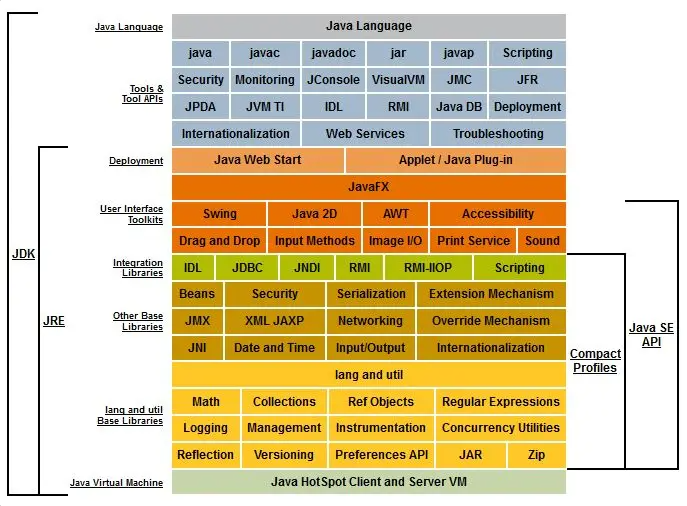
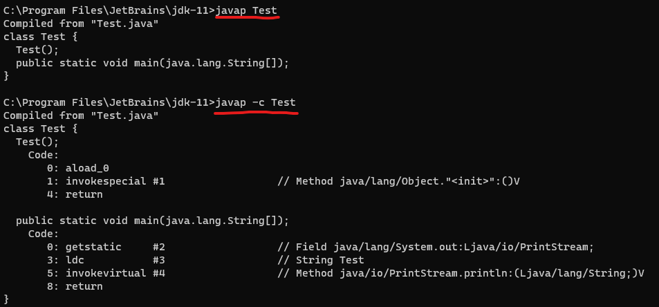
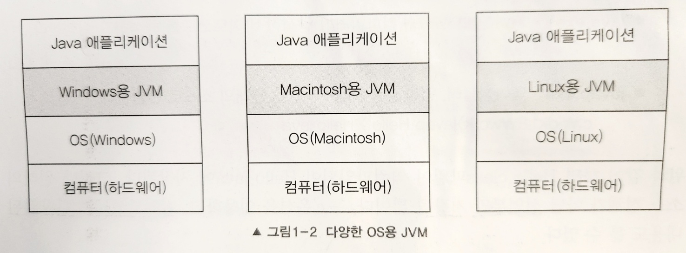

자바로 개발하기 위한 준비물

# JDK

&nbsp; 개인적으로 처음 Java에 발을 들였을 때, 오잉? 했던 부분입니다. Java를 다운로드 하려했더니 JDK를 다운로드하라는 거에요.
진짜 띠용이었지만 그때는 그냥 시키는 대로 했습니다.<br>
Java Development Kit, JDK는 자바로 개발하는데 필요한 도구들을 하나로 묶어 둔 것입니다.<br>

<br>
[JavaSE 8](https://docs.oracle.com/javase/8/docs/)

진짜 많지만 주요한 도구만 보도록 하겠습니다.

## 실행 파일
&nbsp; IntelliJ에서 초록색 세모만 딸깍하면 돼서 자각하지 못했는데,
실제로 실행이라는 건 사람이 해석할 수 있는 코드를 작성한다고 끝나지 않습니다.<br>

&nbsp; 사람의 코드를 해석해서 기계가 이해하는 코드로 변환해야 하죠. 심지어 자바는 JVM이라는 가상의 기계가 중간에 있기 때문에 이 과정을 2번 해야해요.<br>
그러니까 Java 코드를 Compile해서 JVM이 이해할 수 있는 바이트 코드로 바꾸고, JVM은 이 바이트 코드를 Interpreter로 해석 해서 OS를 실행할 명령어를 생성해야 실제로 작동합니다.
이를 위한 실행 파일들은 JDK 설치 시, <span style="background-color: #E2E2E2">bin 디렉토리 내부</span>에 존재합니다.<br>
<br>

### 자바 컴파일러: `javac.exe`
&nbsp; 작성한 <span style="background-color: #E2E2E2">java source code</span>를 JVM이 이해할 수 있는 <span style="background-color: #E2E2E2">byte code</span>로 컴파일합니다.<br>
- 대상: `.java` 파일
  ```bash
    > javac Test.java
  ```
- 실행: `.class` 파일 생성(byte code로 이루어짐)

&nbsp; 여기서 `.java`는 저희가 작성하는 Java, 사람의 코드로 이루어진 Java Source 파일입니다.
`.class`는 JVM이 이해할 수 있는 byte code, 기계어로 이루어져 있는 파일이구요.
실제로 Java application은 여러 개의 class로 구성되어 있으며 하나의 class에서도 상속, 내부 클래스 등 여러 class 정보가 필요할 수 있습니다.
애플리케이션을 실행하기 위해 컴파일러는 필요한 만큼의 클래스 파일을 생성하게 됩니다.<br>
<br>

### 자바 인터프리터: `java.exe`
&nbsp; 컴파일된 <span style="background-color: #E2E2E2">byte code</span>를 해석하고 실행합니다.
- 대상: `.class` 파일
  ```bash
    > java Test
  ```
- 실행: 프로그램 실행

&nbsp; JVM이 자바 인터프리터를 통해 바이트 코드를 해석해 OS를 실행할 명령어를 생성하고, 실행하게 됩니다.<br>
<br>


### 역어셈블러: `javap.exe`
&nbsp; 컴파일된 .class 파일을 원래의 소스 코드로 변환합니다.
- 대상: .class
  ```bash
    > javap Test.java
  ```
- 실행: 해당 클래스 파일을 원래의 소스로 선언부만 변환
- ps. -c 옵션 이용 시, 바이트 코드로 컴파일된 내용 열람 가능

&nbsp; 역어셈블러는 주로 코드를 분석하고 이해하는데 사용합니다. 이를 통해 디버깅이나 보안 분석, 코드 최적화를 할 수 있습니다.<br>
<br>

### 더 많음
&nbsp; 이외에도 더 많은 실행 파일이 있습니다.
처음 나온 [사진](#jdk)도 다가 아니에요.
더 알아보고 싶으시다면 jdk 다운하시고 bin 디렉토ㅓ리 들어가서 확인해 보시길 바랍니다!
Java의 정석에서는 다음의 두 가지만 더 설명하고 있습니다.

- `javadoc.exe`: 자동문서 생성기
  - 소스 파일에 특정 형식(`/**`, `*/`, `@param` 등)의 주석을 통해 코드를 문서화할 수 있습니다. <br>
    우리가 자주 보는 개 구린 [🔗공식 문서](https://docs.oracle.com/en/java/javase/21/docs/api/index.html) 디자인과 동일한 html이 생성됩니다.
  - 대상: `.java`
  - 실행: 특정 형식을 읽어 `.html` 생성
- `jar.exe`: 압축 프로그램
  - 대상: class 파일과 프로그램 실행 관련 파일
    ```bash
    # 압축
    jar cvf Test.jar Test1.class Test2.class
    # 해제
    jar xvf Test.jar
    ```
<br>

### 실습해보기
&nbsp; 실행 파일 부분을 작성하고 보니 조잡하더라구요. 예제를 따로 빼겠습니다. 필요 없으면 [🔗넘어가기](#jre)<br>
주요한 실행 파일을 테스트하기 위해 다음의 코드를 작성했습니다.
```java
class Test {
	public static void main (String[] args) {
		System.out.println("Test");
	}
}
```

간단하게 메모장으로 작성하고 확장자를 `.java`로 저장합니다. "Test"라는 문자열을 콘솔에 출력하는 코드입니다.<br>

<br>

먼저 cmd 창에서 [🔗컴파일러](#자바-컴파일러-javacexe)를 실행하겠습니다.<br>
다음과 같이 Test.class 파일이 생성된 것을 확인할 수 있습니다.<br>

<br>

Test.class를 메모장으로 켜 보면<br>

<br>

요상한 언어가 튀어나옵니다. JVM은 이해하겠죠?<br>
이제 이 녀석을 JVM을 통해 실제로 작동시켜 보겠습니다. [🔗인터프리터](#자바-인터프리터-javaexe)를 실행하면 되죠!

<br>

콘솔 창에 Test 나왔어요. 잘 실행됩니다.<br>

Test.java 파일을 지웠습니다. [🔗역어셈블러](#역어셈블러-javapexe)를 사용해 볼 건데요.<br>

<br>

잘 동작합니다.
위는 -c 옵션을 사용하지 않아 소스 코드의 선언부를 확인할 수 있고,
아래는 -c 옵션을 사용해 바이트 코드로 컴파일된 내용이라고 하는데, 내막은 잘 모르겠습니다..ㅎ<br>
<br>

## JRE
&nbsp; Java Runtime Environment, 자바로 작성된 응용 프로그램을 실행하기 위한 최소 환경입니다.
JDK에는 bin 디렉토리의 실행 파일들과 자바 실행 환경이 있습니다. 자바 실행 환경은 JVM과 Java API를 포함합니다.

&nbsp; 참고로 JDK 9 전에는 `jre` 디렉토리가 JDK에 포함되어 있는데,
JDK 9부터 모듈 시스템을 도입해 `jre` 디렉토리가 사라졌다고 합니다. 나중에 모듈화를 공부해 보겠습니다.
<br><br>

### JVM(Java Virtual Machine)
&nbsp; 여기서 가상 기계(Virtual Machine)라는 말이 괜히 어려워 보여요.<br>
 그냥 기계는 사람을 대신해서 어떤 일을 하는 장치이고, 가상 기계는 실물이 아닌 개념적으로만 존재하는 기계라는 맥락으로 생각해도 무방할 것 같습니다.
 실제로는 소프트웨어로 구현된 컴퓨터의 일부기는 합니다. 책에서는 소프트웨어로 구현된 하드웨어라고 표현하기도 했습니다..<br>

&nbsp; 물론 가상 기계를 작동한다는 건 어떠한 하드웨어(물리 기계)를 사용하겠지만, 요는 가상 기계가 특정한 물리 기계에 의존하지 않는다는 것입니다.
이를 통해 유연성과 이식성을 높일 수 있기 때문에 가상 머신 기술이 많이 발젼했습니다. AWS의 클라우딩 컴퓨팅 서비스도 같은 맥락으로 볼 수 있습니다.

&nbsp; Java는 이 가상 기계에만 의존하기 때문에 Java 가상 기계, 즉 JVM에서만 실행됩니다. JVM이 있다는 가정하에 애플리케이션을 어디서든 실행할 수 있지만, JVM이 필수적이라는 말이죠.

&nbsp; JVM을 계층으로 나타낸 그림입니다.<br>

<br>

&nbsp; 애플리케이션과 OS 사이에 계층이 하나 추가되기 때문에 사람이 작성한 코드를 JVM의 언어(byte code)로, JVM의 언어를 OS의 언어(native code)로 전달하는 과정이 필요합니다.
 운영체제에 독립적이라는 장점이 있으나, 언어를 변환하는 행위를 두 번 해야 하므로 속도가 느리다는 단점이 생기죠.

&nbsp; 하지만 천재들은 JDK 1.3 이후로 JIT 컴파일러를 표준 기능으로 포함해 성능 향상을 했습니다.
인터프리터만을 사용해 바이트 코드를 한 줄씩 읽고 실행했으나 이제는 JIT 컴파일러도 횬옹하여 속도의 격차를 줄일 수 있었죠.
다른 언어들도 발전했을 테고, 여전히 일부 네이티브 언어(특정 플랫폼에 직접 매핑 ex. C, Rust)보다 느리겠지만 단점보다 장점이 더욱 두드러지게 됩니다.

&nbsp; 어쨌든 이 책에서는 JVM으로 인해 "[🔗Write once, run anywhere](/language/java-start-01/#1-운영체제os에-독립적)"(=운영 체제에 독립적)가 가능하다는 게 중요하다고 합니다.

> 💡 JIT(Just-In-Time) 컴파일러
<br> 
<br>  &nbsp; JVM은 인터프리터로 바이트 코드(중간 코드)를 실행하면서 JIT 컴파일러를 통해 실시간 컴파일이 가능합니다.
<br> 다시 말해 프로그램 흐름에 따라 필요한 코드 블록을 동적으로 컴파일하고, 최적화된 기계어(2진수)로 번역해 즉시 실행하는 거죠. 
<br> 
<br> 따라서 실행에 필요한 코드 블록만 메모리에 로드하고, 컴파일과 최적화가 진행되기 실행 때문에 메모리 사용을 감소하는 것은 물론 속도를 향상할 수 있습니다.
<br> 또한, JIT 컴파일러는 생성한 네이티브 코드(기계어)를 캐시에 저장해 재사용할 수 있습니다.

<details>
<summary>GPT가 다듬어준 글 보기</summary>

JVM(Java Virtual Machine)은 자바 프로그램을 실행하는 가상 머신입니다.
이것은 실제 하드웨어가 아니라 소프트웨어로 구현된 컴퓨터 시스템입니다.
이러한 가상 머신은 특정한 물리적인 기계에 의존하지 않고 동일한 실행 환경을 제공함으로써 유연성과 이식성을 높일 수 있습니다.
즉, JVM이 있다면 자바 프로그램은 어느 운영 체제나 하드웨어에서도 실행될 수 있습니다.<br>
<br>

JVM은 프로그램의 실행 중에 자바 바이트 코드(중간 코드)를 해석하여 실행합니다.
이것은 자바 프로그램을 운영 체제나 하드웨어에 종속되지 않게 만드는 장점을 제공하지만, 인터프리터만을 사용하는 경우 실행 속도가 느릴 수 있습니다.<br>
<br>

그러나 JDK 1.3 이후로 JIT 컴파일러가 JVM에 표준으로 포함되어 실행 중에 바이트 코드를 네이티브 코드로 컴파일하여 성능을 향상시킵니다.
JIT 컴파일러는 프로그램의 실행 흐름에 따라 필요한 코드 블록을 동적으로 컴파일하고 최적화하여 실행 속도를 향상시킵니다.
또한, JIT 컴파일러는 생성한 네이티브 코드를 캐시에 저장하여 재사용함으로써 성능을 더욱 개선할 수 있습니다.<br>
<br>

이러한 JIT 컴파일러의 도입으로 자바 프로그램의 성능은 이전보다 크게 향상되었으며, 여전히 자바의 운영 체제에 독립적인 장점을 가지고 있습니다.
이로 인해 "Write once, run anywhere"라는 자바의 주요 장점이 더욱 강조되고 있습니다. 

</details>
<br><br>

### Java API
&nbsp; Java의 정석에서는 클래스 라이브러리(Java API)라고 기재되어 있는데요.

저는 API를 [🔗프로그램의 메뉴판](/cs/http-restapi/#application-programming-interface)이라고 생각합니다.
 Java에서는 제공되는 클래스와 인터페이스를 다양한 기능을 제공하고, 기능에 대한 매뉴얼이므로 API라고 직관적으로 이해할 수 있었습니다.
 클래스 라이브러리는 특정 프로그래밍 언어나 플랫폼에서 사용 가능할 수 있는 클래스와 인터페이스 집합이라고 합니다.
 Java API에 해당하는 각각의 클래스와 인터페이스들이 클래스 라이브러리에 해당합니다. 


&nbsp;  헉스바리 4살의 GPT가 Java API는 사실상 라이브러리의 집합으로, 구체적인 실행 코드를 포함한 라이브러리 형태로 제공한다고 합니다.
 여튼 중요한 Java API는 `java.*`, `javax.*` 패키지에 포함되어 있으며 보통 JDK 설치 디렉토리의 `lib/src.zip` 에 소스 파일이 포함됩니다.
 Java를 효율적으로 잘 활용하기 위해서는 Java API에 대한 이해가 필수이잖아요? Java의 정석에 다 있으니 나중에 링크를 첨부하도록 하겠습니다.

> 💡 라이브러리 vs 프레임워크
<br>
<br> &nbsp; 차이는 제어의 역전에 있습니다. 
<br> 코드 재사용성, 개발 시간 단축 등 공통점이 있으나, 프레임워크가 더 큰 개념입니다.
> 라이브러리는 개발자가 애플리케이션의 흐름을 제어하고 필요에 따라 라이브러리의 기능을 호출합니다.
>  프레임워크는 개발 방식이나 아키텍처를 애플리케이션의 기본 구조를 제공하고, 개발자는 이 흐름에 몸을 맡겨야 합니다.
>  제어를 프레임워크에게 위임하는 거죠.
<br> 
<br> ex. 그림 그리기 위한 색연필, 물감, 브러쉬 vs 색칠 공부 책
<br> &nbsp; &nbsp; &nbsp; 집에서 샌드위치 만드는 재료 vs 서브웨이

<br><br>


# 마무으리
&nbsp; 눈에 보이지 않는 개념을 공부하려니 깨나 어렵습니다.
나중에 성능 관련 공부할 때, 조금이라도 더 익숙하고 이해가 빠르길 바랄 뿐이에요.
코드 칠 때는 더 많이 알면 더 효율적으로 짤 수 있을 거 같아서 공부하고 싶지만 막상 개념을 공부하는 건 조금 지루한 듯.

---
<p> 
  <strong>👀 참고: </strong>
  <span itemprop="keywords">
    <a href="https://product.kyobobook.co.kr/detail/S000001550352" class="page__taxonomy-item p-category">남궁성, 'Java의 정석'</a>
  </span>
</p>
<p> 
  <strong>📑 목차: </strong>
  <span itemprop="keywords">
    <a href="/목차/java-list" class="page__taxonomy-item p-category">Java 목차</a>
  </span>
</p>

<nav class="pagination">
<a href="/language/java-start-01" class="pagination&#45;&#45;pager" title="{{ page.previous.title | markdownify | strip_html }}"> 👈 Java start(1)</a>
<a href="/language/java-start-03" class="pagination&#45;&#45;pager" title="{{ page.previous.title | markdownify | strip_html }}"> Java start(3) 👉</a>
</nav>