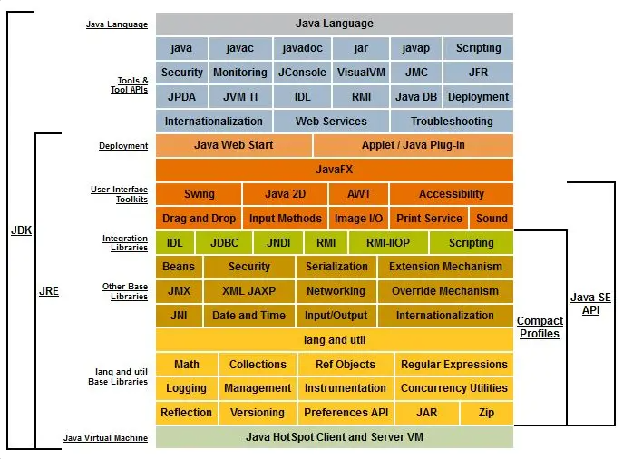
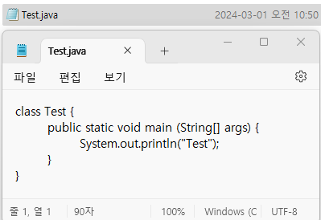
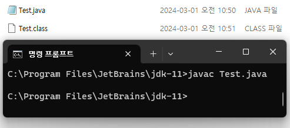
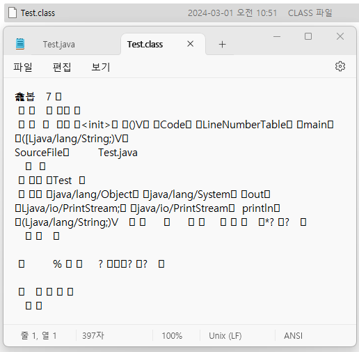
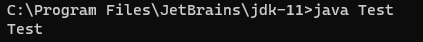
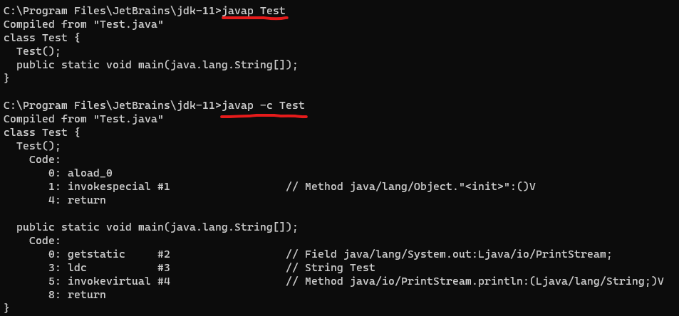

Java의 정석 01장 정리(2)

# JDK

&nbsp; 개인적으로 처음 Java에 발을 들였을 때, 오잉? 했던 부분입니다. Java를 다운로드 하려했더니 JDK를 다운로드하라는 거에요.
진짜 띠용이었지만 그때는 그냥 시키는 대로 했습니다.<br>
Java Development Kit, JDK는 자바로 개발하는데 필요한 도구들을 하나로 묶어 둔 것입니다.<br>

<br>
[JavaSE 8](https://docs.oracle.com/javase/8/docs/)

진짜 많지만 주요한 도구만 보도록 하겠습니다.

## 실행 파일
&nbsp; IntelliJ에서 초록색 세모만 딸깍하면 돼서 자각하지 못했는데,
실제로 실행이라는 건 사람이 해석할 수 있는 코드를 작성한다고 끝나지 않습니다.<br>

&nbsp; 사람의 코드를 해석해서 기계가 이해하는 코드로 변환해야 하죠. 심지어 자바는 JVM이라는 가상의 기계가 중간에 있기 때문에 이 과정을 2번 해야해요.<br>
그러니까 Java 코드를 Compile해서 JVM이 이해할 수 있는 바이트 코드로 바꾸고, JVM은 이 바이트 코드를 Interpreter로 해석 해서 OS를 실행할 명령어를 생성해야 실제로 작동합니다.
이를 위한 실행 파일들은 JDK 설치 시, bin 디렉토리 내부에 존재합니다.<br>
<br>

### 자바 컴파일러: `javac.exe`
&nbsp; 작성한 <span style="background-color: #E2E2E2">java source code</span>를 JVM이 이해할 수 있는 <span style="background-color: #E2E2E2">byte code</span>로 컴파일합니다.<br>
- 대상: `.java` 파일
  ```bash
    > javac Test.java
  ```
- 실행: `.class` 파일 생성(byte code로 이루어짐)

&nbsp; 여기서 `.java`는 저희가 작성하는 Java, 사람의 코드로 이루어진 Java Source 파일입니다.
`.class`는 JVM이 이해할 수 있는 byte code, 기계어로 이루어져 있는 파일이구요.
실제로 Java application은 여러 개의 class로 구성되어 있으며 하나의 class에서도 상속, 내부 클래스 등 여러 class 정보가 필요할 수 있습니다.
애플리케이션을 실행하기 위해 컴파일러는 필요한 만큼의 클래스 파일을 생성하게 됩니다.<br>
<br>

### 자바 인터프리터: `java.exe`
&nbsp; 컴파일된 <span style="background-color: #E2E2E2">byte code</span>를 해석하고 실행합니다.
- 대상: `.class` 파일
  ```bash
    > java Test
  ```
- 실행: 프로그램 실행

&nbsp; JVM이 자바 인터프리터를 통해 바이트 코드를 해석해 OS를 실행할 명령어를 생성하고, 실행하게 됩니다.<br>
<br>


### 역어셈블러: `javap.exe`
&nbsp; 컴파일된 .class 파일을 원래의 소스 코드로 변환합니다.
- 대상: .class
  ```bash
    > javap Test.java
  ```
- 실행: 해당 클래스 파일을 원래의 소스로 선언부만 변환
- ps. -c 옵션 이용 시, 바이트 코드로 컴파일된 내용 열람 가능

&nbsp; 역어셈블러는 주로 코드를 분석하고 이해하는데 사용합니다. 이를 통해 디버깅이나 보안 분석, 코드 최적화를 할 수 있습니다.<br>
<br>

### 더 많음
&nbsp; 이외에도 더 많은 실행 파일이 있습니다.
처음 나온 [사진](#jdk)도 다가 아니에요.
더 알아보고 싶으시다면 jdk 다운하시고 bin 디렉토ㅓ리 들어가서 확인해 보시길 바랍니다!
Java의 정석에서는 다음의 두 가지만 더 설명하고 있습니다.

- `javadoc.exe`: 자동문서 생성기
  - 대상: `.java`
  - 소스 파일에 특정 형식(`/**`, `*/`, `@param` 등)의 주석을 통해 코드를 문서화할 수 있습니다.
- `jar.exe`: 압축 프로그램
  - 대상: class 파일과 프로그램 실행 관련 파일
    ```bash
    # 압축
    jar cvf Test.jar Test1.class Test2.class
    # 해제
    jar xvf Test.jar
    ```
<br>

### 실습해보기
&nbsp; 실행 파일 부분을 작성하고 보니 조잡하더라구요. 예제를 따로 빼겠습니다. 필요 없으면 [🔗넘어가기](#jre)<br>
주요한 실행 파일을 테스트하기 위해 다음의 코드를 작성했습니다.
```java
class Test {
	public static void main (String[] args) {
		System.out.println("Test");
	}
}
```

간단하게 메모장으로 작성하고 확장자를 `.java`로 저장합니다. "Test"라는 문자열을 콘솔에 출력하는 코드입니다.<br>

<br>

먼저 cmd 창에서 [🔗컴파일러](#자바-컴파일러-javacexe)를 실행하겠습니다.<br>
다음과 같이 Test.class 파일이 생성된 것을 확인할 수 있습니다.<br>

<br>

Test.class를 메모장으로 켜 보면<br>

<br>

요상한 언어가 튀어나옵니다. JVM은 이해하겠죠?<br>
이제 이 녀석을 JVM을 통해 실제로 작동시켜 보겠습니다. [🔗인터프리터](#자바-인터프리터-javaexe)를 실행하면 되죠!

<br>

콘솔 창에 Test 나왔어요. 잘 실행됩니다.<br>

Test.java 파일을 지웠습니다. [🔗역어셈블러](#역어셈블러-javapexe)를 사용해 볼 건데요.<br>

<br>

잘 동작합니다.
위는 -c 옵션을 사용하지 않아 소스 코드의 선언부를 확인할 수 있고,
아래는 -c 옵션을 사용해 바이트 코드로 컴파일된 내용이라고 하는데, 내막은 잘 모르겠습니다..ㅎ<br>
<br>

## JRE
&nbsp; Java Runtime Environment, 자바로 작성된 응용 프로그램을 실행하기 위한 최소 환경입니다.
JDK에는 bin 디렉토리의 실행 파일들과 자바 실행 환경이 있습니다. 자바 실행 환경은 JVM과 Java API를 포함합니다.

&nbsp; 참고로 JDK 9 전에는 `jre` 디렉토리가 jdk에 포함되어 있는데,
JDK 9부터 모듈 시스템을 도입해 `jre` 디렉토리가 사라졌다고 합니다. 나중에 모듈화를 공부해보겠습니다.

### JVM

### Java API
&nbsp; Java의 정석에서는 클래스 라이브러리(Java API)라고 기재되어 있는데요.. 여기서 라이브러리와 API의 단어의 차이가 있는지 의문이 생겼습니다.
와 얼마 안남았다고 생각했는데 JVM이랑 이거 뭐 어케해야 할지 의문이구만유

---
<p> 
  <strong>👀 참고: </strong>
  <span itemprop="keywords">
    <a href="https://product.kyobobook.co.kr/detail/S000001550352" class="page__taxonomy-item p-category">남궁성, 'Java의 정석'</a>
  </span>
</p>
<p> 
  <strong>📑 목차: </strong>
  <span itemprop="keywords">
    <a href="/목차/standard-of-java" class="page__taxonomy-item p-category">Java의 정석 정리</a>
  </span>
</p>

<nav class="pagination">
<a href="/language/standard-of-java-01_1" class="pagination&#45;&#45;pager" title="{{ page.previous.title | markdownify | strip_html }}"> 👈 01장(1)</a>
<a href="/language/standard-of-java-01_3" class="pagination&#45;&#45;pager" title="{{ page.previous.title | markdownify | strip_html }}"> 01장(3) 👉</a>
</nav>