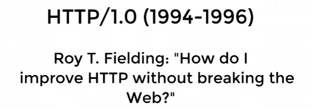
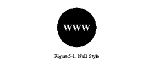
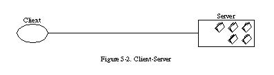
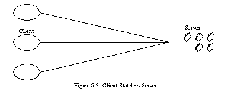
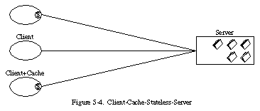
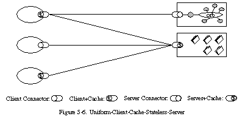
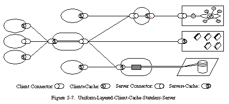
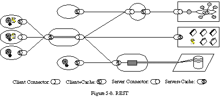
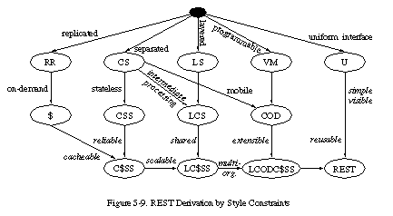

# Representational State Transfer Application Programming Interface


<br>
&nbsp; 사실 개발자의 진정한 덕목은 준말을 자유자재로 사용하는 것이 아닐까요? 개덕준사.<br>


## REpresentational State Transfer?
&nbsp;[🔗ORACLE](https://docs.oracle.com/database/apex-18.1/AEUTL/what-is-REST.htm#AEUTL29132)에서 다음과 같이 정의합니다.<br> 
> a way of providing interoperability between computer systems on the Internet<br>
*인터넷상에서 컴퓨터 시스템 간의 상호 운용성을 제공하는 방법*
 
interoperablility: [🔗상호운용성](https://aws.amazon.com/ko/what-is/interoperability/) <br>
이 단어를 위해 다음과 같은 집착을 합니다.
- referer 오타지만 고치지 않음
- charset 잘못 지은 이름이지만 고치지 않음
- HTTP 상태 코드 418 포기함(i'm a teapot)
- HTTP/0.9 아직도 지원함(크롬, 파이어폭스)

nbsp;처음에는 상호운용성이라는 단어가 와닿지 않더라구요. 다음의 **등장 배경**을 보고 직관적으로 이해했습니다.<br>

### 등장 배경
&nbsp;Roy 씨가 HTTP 명세를 작성하는 당시, HTTP는 Word Wide Web(www)의 전송 프로토콜로 이용되고 있었다고 합니다.<br>
&nbsp;HTTP를 제멋대로 고치면 이미 구축되어 있는 Web과 호환에 문제가 생길 것 같아요.<br>
<br>
nbsp;따라서 다음과 같은 고민을 합니다.<br>

<br>

&nbsp;*어떻게 하면 Web을 망가뜨리지 않고 HTTP를 향상시키지?* 이에 대한 해결책으로 `HTTP Object Model`이 등장하고, <br>
1998년 `REST`라는 이름으로 발표합니다.
> [🔗Representational State Transfer: An Architectural Style for Distribution Hypermedia Interaction](https://ics.uci.edu/~fielding/talks/webarch_9805/index.htm)
<br> <span style="color: #808080">*표현적인 상태 전송: 분산 하이퍼미디어 시스템(ex. web)을 위한 아키텍처 스타일*</span>

&nbsp;이게 지금 그거는 아니고, 대학원생이었던 Roy 씨는 야무지게 정리해서 2년 후인<br>
2000년, 지금의 `REST`라고 정의하는 논문을 발표합니다.
> [🔗Architectural Styles and the Design of Network-based Software Architectures](https://ics.uci.edu/~fielding/pubs/dissertation/top.htm)
, Roy T. Fielding

영어 잘하게 되면 이 논문을 읽어보겠습니다.<br>

### REST
❗HTTP❗로 통신할 때, `상호운용성`을 제공하기 위해 나온 ❗아키텍처 스타일❗<br>

## Application Programming Interface?
&nbsp;고유한 기능을 가진 소프트웨어에서 구성 요소가 상호 간에 통신할 수 있도록 하는 메커니즘이라고 합니다.<br>
정의는 언제나 어려운 것 같아요. [🔗코딩애플](https://www.youtube.com/watch?v=ckSdPNKM2pY&t=106s)에서는 메뉴판이라고 비유하는 데 직관적으로 이해됐어요.

### 등장
2000년, Salesforce API가 거의 최초로 공개된 API라고 합니다.
바로 요 녀석이 SOAP API입니다.
```xml
<?xml version="1.0" encoding="utf-8" ?>
<soapenv:Envelope xmlns:soapenv="http://schemas.xmlsoap.org/soap/envelope/"
                  xmlns:urn="urn:enterprise.soap.sforce.com">
    <soapenv:Header>
        <urn:SessionHeader>
            <urn:sessionId><b>QwWsHJyTPW.1pd0_jXLNKOSU</b></urn:sessionId>
        </urn:SessionHeader>
    </soapenv:Header>
    <soapenv:Body>
        <urn:retrieve>
            <urn:fieldList><b>Id, Name, Website</b></urn:fieldList>
            <urn:sObjectType><b>Account</b></urn:sObjectType>
            <!-- Zero or more repetitions:-->
            <urn:ids><b>001D000000HS2Su</b></urn:ids>
            <urn:ids><b>001D000000HRzKD</b></urn:ids>
        </urn:retrieve>
    </soapenv:Body>
</soapenv:Envelope>
<!-- ID로 Object 하나를 가져오는 API 요청 메시지인데 잠 깰 겸 쳐봤지만 끔찍하군요-->
```
<br>

### 4개 밖에 있음

&nbsp; 저는 개인적으로 REST API부터 접했기에 API랑 REST API를 분리하는 게 어려웠어요^^> <br>
그래서 API의 종류를 간단하게 찾아봤습니다.

1. SOAP API - `STMP`로도 요청 가능.
2. RPC API
3. Websocket API - `TCP` 냅다 연결
4. REST API - `HTTP`를 효율적으로 쓰기위해서 고안한 아키텍쳐 스타일임.


`SOAP`: Microsoft가 개발한 XML-RPC(1998) 프로토콜에 부가적인 기능을 추가한 `프르토콜`, ~~XML-RPC가 더 많이 사용된다고 합니다.~~ <br>
&nbsp;&nbsp;&nbsp;&nbsp;&nbsp;&nbsp;&nbsp;&nbsp;&nbsp;&nbsp;&nbsp;&nbsp; 
그렇지만 보안이 깨나 엄격하고, ACID를 준수해서 기업용 애플리케이션에 쓰일 수 있다고 합니다. <br>
`RPC`: remote procedure call, 원격으로 다른 시스템의 메서드를 호출할 수 있는 `프로토콜`, <br>
&nbsp;&nbsp;&nbsp;&nbsp;&nbsp;&nbsp;&nbsp;&nbsp;&nbsp;&nbsp;&nbsp;&nbsp;
REST는 자원이나 객체에 초점을 맞추는 반면, 이 친구는 기능이나 작업에 초점을 맞춘다고 합니다.<br>

### API
프로그램의 메뉴판!!
<br>

# REST API

## 등장

&nbsp;2004년, flickr에서 여러가지 형태의 API가 나왔습니다.

```xml
<?xml version="1.0" encoding="utf-8" ?>
<s:Envelope xmlns:s="http://www.w3.org/2001/06/soap-envelope">
  <s:Body>
    <s:Fault>
      <faultcode>flickr.error.[error-code]</faultcode>
      <faultstring>[error-message]</faultstring>
      <faultactor>http://www.flickr.com/services/soap/</faultactor>
      <details>Plese see http://www.flickr.com/services/docs for more details</details>
    </s:Fault>
  </s:Body>
</s:Envelope>
```
&nbsp; SOAP API( ↑ ), REST API( **↓** )

```xml
<?xml version="1.0" encoding="utf-8" ?>
<rsp stat="fail">
  <err code="[error-code]" msg="[error-message]" />
</rsp>
```

&nbsp;하지만 변태가 아니라면 REST를 쓰고 싶잖아요.<br>
그렇다면 REST API, 그러니까 REST라는 아키텍처 스타일을 만족하려면 어떻게 해야 할지 알아볼게요.

## Rest 아키텍처 스타일 제약 조건
&nbsp; 완벽할 수 없다는 것은 알지만 이왕 공부하는 거 완벽하게 하고 싶어요...<br>
[🔗Joy씨의 논문](https://ics.uci.edu/~fielding/pubs/dissertation/rest_arch_style.htm#sec_5_1) CHAPTER 5.1에 해당하는 부분을 "제멋대로" 해석해 보겠습니다.<br>
이 Chapter에서는 REST가 아키텍처 스타일로서 파생되는 과정을 따라가며 개요를 제공해줍니다.

### 0. Null
&nbsp;an empty set of constraint! 처음은 당연히 어떤 제약조건도 없습니다.<br>

<br>

&nbsp;<span style="color: #808080">다만 아키텍처를 설계할 때, 제약없이 요구 사항만 가지고 시작해서 점차적으로 시스템과 조화롭게 제약 조건을 적용했다고 합니다.
이렇게 하면 시스템의 맥락에 대한 제약과 이해를 더 강조한다고 하네요. 
마냥 구성 요소를 추가하는 것 보다는 당연히 제약이 강조되고, 그러다 보면 맥락이 이해가 되지 않을까요?</span><br>
<br>
**저는 바보라서 그냥 Null에서 시작한다고 알고 넘어가겠습니다.**


### 1. Client-Server
&nbsp; 첫 번째로 추가된 이 녀석의 기본 원칙은 ❗관심사의 분리(Soc)❗ 입니다. <br>
<u>사용자 인터페이스</u>와 <u>데이터의 저장</u> 두 관심사를 분리하는 겁니다.<br>

<br>

&nbsp;'분리'가 각 구성 요소를 '독립적'으로 '진화'할 수 있게 한다는 것이죠.<br>
그럼 확장성을 향상할 수 있고, 인터넷 규모의 여러 도메인들의 요구사항을 지원할 수 있습니다.<br>

&nbsp; <span style="color: #808080"> client는 trigger, server는 trigger에 따라 반응하는 process라고 Andrews 씨가 말했대요.
생각해보면 client는 필요할 때만 방아쇠를 당기겠지만 server는 연신 돌아가고 있어야 하네요. 참고로 이 친구도 아키텍처 스타일이에요. </span><br>


### 2. Stateless
&nbsp; 다음으로 무상태를 추가합니다. 이 녀석은 서버에 상태가 없어야 한다는 제약이에요.<br>
제약을 지키면 서버에 저장된 컨텍스트를 활용할 수 없겠죠? <br>
그렇기 때문에 client가 server에게 요청 시, 요청을 이해하기 위한 ❗모든 정보를 포함해 요청❗해야 합니다.<br>

<br>

&nbsp; 이 아키텍처 스타일을 따르면 가시성, 신뢰성, 확장성을 향상할 수 있어요.<br>
모든 정보가 들어있으니, 모니터링 시스템은 단일요청만 봐도 가시적으로 알 수 있겠죠?<br>
잘못된 부분이 있는 경우, 해당하는 부분만 고칠 수 있어요.
예를 들어 서버1에서 장애가 발생하면, 서버2를 호출하면 돼요. 어차피 요청에 다 있잖아요.
깨나 믿을 만하네요.<br>
그리고, 서버를 한 100개 만들어도 같은 기능을 하면 되니까 수평 확장에 유리합니다.<br>

그런데! 단점도 있어요. 
귀찮아요. 는 아니고 아무래도 클라이언트가 데이터를 추가적으로 전송해야하고, 네트워크 성능 저하 가능성이 있다고 합니다.


&nbsp; <span style="color: #808080">client-stateless-server라고 하면 더 와닿을까요? 
사실 client-server에 해당 제약을 추가하며 파생된 친구입니다.<br>
김영한님은 점원을 서버로 예를 들어 주셨어요.
stateless는 요청마다 모든 정보를 포함해서 중간에 점원이 바뀌어도 됩니다.<br>
"노트북 얼마에요?" "만원이요." "하나 주세요" "뭐를요?" vs "노트북 얼마에요?" "만원이요.""노트북 두 개 주세요.""이만원~"</span><br>


### 3. Cache
&nbsp; 네트워크 성능 저하? cache 제약 조건을 추가해 네트워크의 효율성을 향상하겠습니다.<br>
먼저 응답 데이터에 캐시 가능 여부를 `cacheable`/`non-cacheable` 라벨을 붙여 나타내 줍니다.<br>
캐시가 가능하다면 클라이언트 캐시에 응답을 재사용할 수 있는 권한이 부여됩니다.

<br>

&nbsp; cache를 사용하면 이전의 응답을 재사용하잖아요?
그렇다면 응답을 얻기 위한 컴퓨터 사이에서 할 통신이 부분적으로든 완전히든 줄어들 거예요.<br>
다시 말해, 일련의 상호 작용하는데 필요한 평균 대기 시간을 줄여 효율성, 확장성, 사용자 경험을 향상할 수 있습니다.

&nbsp; 하지만 캐시 시간 초과 직전의 오래된 데이터가 당장의 요청에 대한 데이터와 다를 가능성이 있습니다. 
신뢰성이 조금 감소해요.


&nbsp; <span style="color: #808080">
94년도 이전에는 정적 리소스 제공을 위한 client-stateless-server에 중점을 두었어요.
공통 client-server 구현 라이브러리를 사용해 웹 애플리케이션 전체의 일관성을 유지했습니다.
비공유 캐시에 대해서는 기초적인 지원만 하고 일관 되게 제한하지는 않았다는 말이죠.</span><br>

&nbsp; <span style="color: #808080">
하지만 개발자들은 깨나 빠릅니다. 논문을 작성하는 당시 2000년에 이미 초기 설계를 넘어섰어요.<br>
요청은 응답을 동적으로 생성하는 서비스, 그러니까 동적 콘텐츠까지 식별할 수 있었습니다.<br>
프록시와 공유 캐시 형태의 매개체(intermediary) 구성 요소에 대한 작업이 시작되었는데, 안정적으로 통신하려면 프로토콜의 확장이 필요했습니다.<br>
어떻게 확장했길래 최신 웹 아키텍처를 형성할 수 있었는지 깨나 궁금하군요.<br>
다음 장의 추가 제약 조건을 보겠습니다.</span>

### 4. Uniform Interface
&nbsp; 다른 네트워크 기반 스타일과 차별화되는 REST의 핵심 기능은
바로!!!!! 구성 요소 간 통일된 인터페이스를 강조한다는 것입니다. 

<br>
<span style="color: #808080"> 참고로 잘 안 보이는 저 글씨는 Connector일 거 같아요^^></span><br>

&nbsp; Component Interface에 소프트웨어 엔지니어링 일반 정책을 적용하면 전체 시스템 아키텍처가 간단해지고, 통신의 가시성이 향상됩니다.<br>
구현이 제공 서비스와 분리되고, ❗독립적인 발전을 촉진❗해요. <br>
그러니까 서버의 기능이 변경되어도 클라이언트를 업데이트할 필요가 없다는 말이죠.<br>

&nbsp; 물론 정보가 특정 application의 요구 사항에 맞는 형식이 아닌, 표준화된 형식으로 전송되기 때문에 효율이 떨어지긴 합니다.
또한 REST가 대규모 하이퍼미디어 데이터 전송에는 효율적이고, Web의 일반적인 상황에서는 최적화되어 있지만, 다른 아키텍처 통신 규격에서는 적합하지 않은 인터페이스가 되죠.<br>

&nbsp; 하지만 [🔗Roy씨가 했던 고민](#등장-배경)을 해결하는 데 깨나 적합해 보입니다.<br>
REST에서 정의한 4가지 인터페이스 제약 조건을 알아봅시다.
이 녀석들은 구성 요소의 동작에 가이드라인을 제시해 주고, 모두 지켜야 Uniform Interface를 만족하는 거예요.
> 1. identification of resources<br>
   <span style="color: #808080">자원을 URI로 식별할 수 있다.</span>
> 2. manipulation of resources through representations<br>
   <span style="color: #808080">표현을 통해 자원 조작할 수 있다. (HTTP method에 표현을 담아 전송한다.)</span>
> 3. self-descriptive messages<br>
   <span style="color: #808080"> 메시지는 스스로를 표현한다.</span><br>
   <span style="color: #808080">ex. Host, Content-Type, 각 json에 대한 명세</span>
> 4. hypermedia as the engine of application state(HATEOAS)<br>
<span style="color: #808080"> 애플리케이션의 상태는 Hyperlink를 이용해 전이되어야 한다.</span><br>
<span style="color: #808080"> JSON의 경우 Link Header를 통해 구현 가능</span><br>

&nbsp; <span style="color: #808080"> 여기서 3번 4번은 잘 지켜지지 않아서 Joy씨의 발작 버튼이 됩니다.</span><br>


### 5. Layered System
&nbsp; 인터넷 규모의 요구 사항이 깨나 방대해진 것 같아요.
이에 대한 동작을 개선하기 위해 계층화 시스템 제약 조건을 추가합니다.<br>
각 구성 요소가 인접한 계층만 볼 수 있고, 해당 계층 너머를 볼 수 없도록 제한해 Layered 아키텍처로 구성할 수 있습니다. <br>
그렇게 구성된 각 계층은 상위 계층에 서비스를 제공하고, 하위 계층의 서비스를 사용하죠.<br>

<br>

&nbsp; 시스템이 단일 계층만 알 수 있도록 제한해 전체 시스템의 복잡성에 경계를 두고, 각 층의 독립성을 촉진합니다.
또한 계층 간 경계를 넘는 데이터에 보안 정책을 강제할 수 있다고 하네요.<br>

&nbsp; 단점으로 데이터를 처리하는 데 필요한 비용과 지연 시간이 늘어나고, 사용자 경험이 감소하긴 합니다.
하지만 이 전의 캐시 제약 조건을 지원하는 네트워크 기반 시스템이라는 전제하에! 공유 캐시를 경계에 배치해서 얻는 성능 이점으로 상쇄할 수 있습니다.<br>

&nbsp; <span style="color: #808080">
으악.. 어려운 문장들이 대거 등장했습니다. 더 공부해서 네트워크에 대해 깊게 이해하고 다시 읽어봐야 할 것 같아요! <br>
먼 말인지 모르겠는 내용은 다음과 같습니다.<br>1. 레거시 서비스를 캡슐화하고, 레거시 클라이언트 서비스로부터 보호할 수 있고, 자주 사용하지 않는 기능을 공유 매개체로 이동함으로써 구성 요소를 단순하게 합니다. 
매개체는 여러 네트워크와 프로세서에 걸쳐 서비스의 로드 밸런싱을 활성화하며 시스템 확장성을 향상하는 데 이용됩니다. <br>2. 
Layered System과 Uniform Interface 제약 조건 조합은 균일한 pipe-and-filter 패턴과 비슷한 아키텍처 특성을 유도합니다.
REST 통신은 two-way지만, 하이퍼미디어 통신의 대규모 데이터 흐름은 각각 네트워크처럼 처리될 수 있습니다.
뭔가 데이터 스트림마다 변환 필터를 적용할 수 있다고 하는데 떠오르는 게 딱히 없네용..
</span>

### 6. code-on-demand(optional)
&nbsp; 드디어 마지막 제약 조건이 추가됩니다. 특이하게도 이 녀석은 선택 사항이에요.<br>
 클라이언트에서 리소스에 접근할 수 있지만, 처리 방법에 대한 노하우는 없습니다. 그저 해당 노하우가 있는 코드를 서버에 요청하고, 이 코드를 받아 로컬에서 실행하는 거죠.
 JavaScript를 생각할 수 있습니다.<br>

<br>

&nbsp;클라이언트의 기능을 확장할 수 있고, 배포 후 기능을 다운로드할 수 있도록 허용하면 시스템 확장성이 향상됩니다.

&nbsp;하지만 단순 데이터가 아닌 코드를 전송함으로써 가시성을 감소시키기 때문에 REST에서는 선택 사항으로 둡니다.<br>
가시성은 클라이언트가 서버를 신뢰할 수 없는 경우 개발에 문제가 된다고 하네요.


&nbsp; <span style="color: #808080">
제약 조건을 선택한다는 모순을 Joy씨가 추가로 설명해 주시는데 이것도 나중에 다시 봐야 할 것 같아요.
해당 제약 조건을 선택했을 때, 일반적으로는 원하는 대로 설계할 수 있지만, 일부 상황에서는 비활성화될 수 있음을 이해해야 한다고 합니다~.
</span><br>

### 끗~
&nbsp; 다음의 그림은 네트워크 기반의 아키텍처 스타일 용어로 REST의 제약 조건이 파생된 과정을 보여줍니다.<br>
논문 3장에 있기는 한데, 궁금하면 [🔗읽 어 보 기](https://ics.uci.edu/~fielding/pubs/dissertation/net_arch_styles.htm)<br>

<br>

## REST API

REST 아키텍처 스타일의 ❗모든❗ 제약 조건을 만족하는 API<br>

&nbsp; <span style="color: #808080">
사실 Roy씨는 무조건 다 지켜야 REST API라고 하지만, 생각보다 그렇게 잘 지켜지지는 않는 것 같아요. 뻔뻔하게 REST라고 우기던지, 창조자인 Roy씨의 입맛에 맞게 열심히 제약을 지켜보든지 선택은 자유!
</span><br>

# 마무리
&nbsp; spring framework나 java는 원리에 대한 설명보다는 참고하기 쉽게 사용 위주로 정리하더라구요.
해서 Naver D2의 '그런 REST API로 괜찮은가'를 정리할 심산이었습니다. 그런데 해당 영상에서 강조하는 Uniform Interface를 외의 다른 아키텍처 스타일도 더 깊이 알고 싶었어요.
찾아보니 관련된 한국어 문서들이 다 번역한 냄새가 났습니다.

&nbsp; 원문을 읽어보고 싶었어요. 이참에 공식 문서 읽는 거에 익숙해져 보자 하고 시작했거든요?
Spring이든 뭐든 강의를 구매하는 이유를 깨달았지 뭐예요... 선생님들께서 다 공부하고 필요한 내용만 뽑아낸 시간의 값어치가 어마무시하다고 생각합니다.
여튼 이왕 시작했으니까 어떻게든 했는데 이게 도움이 됐는지는 잘 모르겠어요. 지금은 다 아는 것 같아도 나중에 이거 읽어보면 이해를 제대로 못 한 게 보일지도,,ㅜ

&nbsp; 그래도 REST는 잊지 않을 듯?
🌟 오 별 귀엽다.


---
<p> 
  <strong>👀 참고: </strong>
  <span itemprop="keywords">
    <a href="https://www.youtube.com/watch?v=RP_f5dMoHFc" class="page__taxonomy-item p-category">이응준, '그런 REST API로 괜찮은가'</a><span class="sep">, </span>
    <a href="https://aws.amazon.com/ko/what-is/api/" class="page__taxonomy-item p-category">aws, 'API란 무엇인가요?'</a><span class="sep">, </span>
    <a href="https://www.youtube.com/watch?v=ckSdPNKM2pY&t=106s" class="page__taxonomy-item p-category">코딩애플, '코딩초보들이 헷갈리는 용어 : API가 뭐냐면'</a><span class="sep">, </span>
    <a href="https://aws.amazon.com/ko/what-is/restful-api/" class="page__taxonomy-item p-category">aws, 'RESTful API란 무엇인가요?'</a>

  </span>
</p>